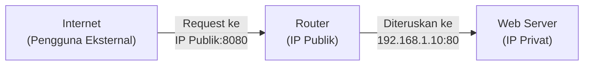
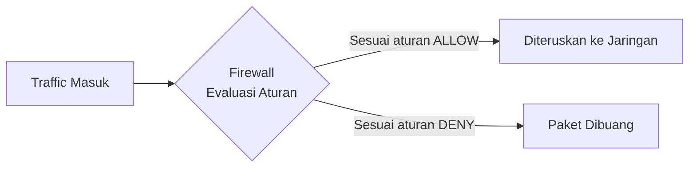
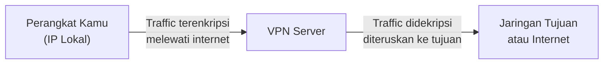

# TryHackMe: [Extending Your Network]
- **Room Link:** [https://tryhackme.com/room/extendingyournetwork](https://tryhackme.com/room/extendingyournetwork)
- **Category:** Pre-Security
- **Difficulty:** Easy

_(Untuk dasar-dasar jaringan lokal, cek catatan [Intro To LAN](../Intro-To-LAN.md). Penjelasan mendalam tentang firewall ada di [Firewall Fundamentals](../../Cyber-Security-101/Security-Solutions/Firewall-Fundamentals.md))_

---

## Introduction

Jaringan lokal yang sudah kamu bangun pada dasarnya masih terisolasi — perangkat di dalamnya bisa saling berkomunikasi, tapi belum bisa berinteraksi dengan jaringan luar secara terkontrol dan aman.

Tiga mekanisme utama yang menghubungkan sekaligus melindungi jaringan lokal dari dunia luar adalah **Port Forwarding**, **Firewall**, dan **VPN** (_Virtual Private Network_). Ketiganya bekerja di lapisan yang berbeda dan menyelesaikan masalah yang berbeda pula.

**Attack Context:**

- **Kapan relevan?** Pemahaman tentang port forwarding, firewall, dan VPN adalah prasyarat sebelum mempelajari network exploitation, firewall evasion, dan pivoting.
- **Syarat yang dibutuhkan:** Pemahaman dasar tentang IP Address, port, dan protokol TCP/UDP.
- **Tanda keberhasilan:** Mampu mengidentifikasi konfigurasi yang salah pada port forwarding atau firewall yang bisa dieksploitasi sebagai titik masuk ke jaringan internal.

Setelah menyelesaikan room ini, kamu akan paham:

- Bagaimana port forwarding menghubungkan layanan internal ke jaringan publik.
- Cara firewall memfilter traffic berdasarkan aturan yang dikonfigurasi.
- Bagaimana VPN membuat koneksi terenkripsi antar jaringan yang berbeda.

---

## Port Forwarding

### What is Port Forwarding?

Setiap jaringan lokal umumnya hanya memiliki **satu IP publik** — IP yang terlihat dari internet. Semua perangkat di dalam jaringan menggunakan IP privat yang tidak bisa diakses langsung dari luar.

**Port Forwarding** adalah mekanisme di mana router menerima koneksi masuk pada IP publik dan port tertentu, lalu meneruskannya ke perangkat dengan IP privat dan port yang sudah dikonfigurasi di jaringan lokal.

Tanpa port forwarding, request dari internet tidak tahu harus diteruskan ke perangkat mana di dalam jaringan lokal — karena router tidak punya instruksi untuk itu.

> **for your information:** **IP Publik** adalah alamat IP yang dapat diakses langsung dari internet dan bersifat unik secara global. **IP Privat** adalah alamat IP yang hanya berlaku di dalam jaringan lokal dan tidak bisa diakses langsung dari internet — contoh rentangnya: `192.168.x.x`, `10.x.x.x`, `172.16.x.x`.

**Contoh skenario konkret:**

Kamu menjalankan web server di komputer dengan IP privat `192.168.1.10` pada port `80`. IP publik jaringanmu adalah `203.0.113.5`. Tanpa port forwarding, tidak ada yang bisa mengakses web server tersebut dari internet. Dengan port forwarding, kamu mengkonfigurasi router untuk meneruskan semua koneksi ke `203.0.113.5:80` ke `192.168.1.10:80` secara otomatis.

**Relevansi keamanan:**

Port forwarding yang salah dikonfigurasi adalah salah satu sumber eksposur layanan internal yang paling umum. Layanan yang seharusnya hanya diakses secara internal — seperti panel administrasi, database, atau remote desktop — bisa terekspos ke internet jika port forwarding dikonfigurasi tanpa pembatasan yang tepat.

> **Common Mistake:** Port forwarding membuka akses dari internet ke layanan internal. Jika layanan yang di-forward tidak menggunakan autentikasi yang kuat atau memiliki kerentanan yang belum ditambal, penyerang yang menemukan port tersebut terbuka bisa langsung mengeksploitasinya. Selalu batasi IP sumber yang diizinkan jika memungkinkan, jangan buka ke `0.0.0.0` tanpa alasan yang jelas.

---

## Firewall

### What is a Firewall?

**Firewall** adalah sistem keamanan jaringan yang memantau dan memfilter traffic berdasarkan sekumpulan aturan yang telah dikonfigurasi. Setiap paket data yang masuk atau keluar dievaluasi terhadap aturan-aturan ini — jika memenuhi kriteria yang diizinkan, paket diteruskan; jika tidak, paket dibuang.

Firewall mengevaluasi traffic berdasarkan empat parameter utama:

- **Source** — dari mana traffic berasal (IP address sumber)
- **Destination** — ke mana traffic menuju (IP address tujuan)
- **Port** — layanan apa yang dituju (nomor port)
- **Protocol** — protokol apa yang digunakan (TCP, UDP, ICMP)

### Stateful vs Stateless Firewall

Ada dua pendekatan utama dalam cara firewall memproses traffic:

| Aspek | Stateful | Stateless |
| :--- | :--- | :--- |
| **Cara kerja** | Melacak seluruh status koneksi — mengetahui apakah sebuah paket adalah bagian dari sesi yang sudah terbangun atau koneksi baru yang mencurigakan | Mengevaluasi setiap paket secara independen tanpa memperhitungkan konteks koneksi sebelumnya |
| **Keandalan** | Lebih akurat dalam mendeteksi serangan yang memanfaatkan sesi yang sudah terbuka | Lebih rentan terhadap serangan yang memecah payload ke dalam banyak paket kecil |
| **Performa** | Membutuhkan lebih banyak resource karena harus menyimpan state table | Lebih cepat dan ringan karena tidak ada overhead pelacakan sesi |
| **Cocok untuk** | Jaringan enterprise yang membutuhkan keamanan tinggi | Jaringan dengan traffic volume tinggi yang memprioritaskan performa |

> **for your information:** **State table** adalah tabel yang disimpan oleh stateful firewall berisi informasi tentang semua koneksi aktif — termasuk IP sumber, IP tujuan, port, dan status koneksi saat ini. Dengan tabel ini, firewall bisa membedakan paket yang merupakan bagian dari koneksi sah dengan paket yang mencoba menyusupi sesi yang sudah ada.

**Relevansi keamanan:**

Dari perspektif attacker, stateless firewall lebih mudah dilewati karena hanya memeriksa header paket secara individual. Teknik seperti **packet fragmentation** — memecah payload berbahaya ke dalam banyak paket kecil — sering digunakan untuk melewati stateless firewall yang tidak bisa merekonstruksi konteks lengkap dari traffic tersebut.

> **for your information:** **Packet fragmentation** adalah teknik memecah satu paket besar menjadi beberapa paket kecil. Dalam konteks serangan, ini digunakan untuk menyembunyikan payload berbahaya dari inspeksi firewall yang hanya memeriksa paket satu per satu tanpa merekonstruksi keseluruhan aliran data.

---

## VPN

### What is a VPN?

**VPN** (_Virtual Private Network_) adalah teknologi yang membangun koneksi terenkripsi antara dua titik melalui jaringan publik — seolah-olah keduanya terhubung langsung dalam satu jaringan privat yang sama, meskipun secara fisik berada di lokasi yang berbeda.

Seluruh traffic yang melewati koneksi VPN dienkripsi — pihak ketiga yang mengintersep koneksi di tengah jalan hanya akan melihat data terenkripsi yang tidak bisa dibaca tanpa kunci dekripsi yang benar.

**Tiga manfaat utama VPN:**

| Manfaat | Penjelasan |
| :--- | :--- |
| **Koneksi jaringan jarak jauh** | Menghubungkan dua jaringan lokal yang berbeda lokasi geografis seolah berada dalam satu jaringan yang sama — umum dipakai untuk remote work ke jaringan kantor |
| **Privasi komunikasi** | Seluruh traffic dienkripsi sehingga tidak bisa dibaca oleh penyedia layanan internet atau pihak ketiga yang mencegat koneksi |
| **Anonimitas IP** | IP address yang terlihat oleh server tujuan adalah IP VPN server, bukan IP asli pengguna |

### VPN Technologies

Ada beberapa protokol dan teknologi yang digunakan untuk membangun koneksi VPN, masing-masing dengan trade-off yang berbeda:

| Teknologi | Cara Kerja | Kelebihan | Kekurangan |
| :--- | :--- | :--- | :--- |
| **PPP** (_Point-to-Point Protocol_) | Membangun koneksi langsung antara dua titik menggunakan autentikasi berbasis private key dan public certificate | Menjadi fondasi protokol VPN lain | Tidak bisa melakukan routing sendiri antar jaringan yang berbeda |
| **PPTP** (_Point-to-Point Tunneling Protocol_) | Membungkus koneksi PPP ke dalam tunnel yang bisa melintasi jaringan berbeda | Mudah dikonfigurasi, didukung hampir semua platform | Enkripsinya lemah — tidak direkomendasikan untuk kebutuhan keamanan tinggi |
| **IPSec** (_Internet Protocol Security_) | Mengenkripsi setiap paket IP menggunakan standar kriptografi yang kuat | Enkripsi sangat kuat, didukung luas di perangkat enterprise | Konfigurasi lebih kompleks dibanding PPTP |

> **for your information:** **Private key** adalah kunci kriptografi yang bersifat rahasia dan hanya diketahui oleh pemiliknya — digunakan untuk mendekripsi data yang dienkripsi dengan public key pasangannya. **Public certificate** adalah dokumen yang berisi public key dan informasi identitas, digunakan untuk memverifikasi keaslian sebuah entitas dalam komunikasi terenkripsi.

**Relevansi keamanan:**

Dalam konteks penetration testing, VPN digunakan untuk dua tujuan utama. Pertama, mengakses jaringan internal target setelah mendapat akses awal — penyerang sering memasang VPN client di mesin yang sudah dikompromis untuk mempertahankan akses jarak jauh. Kedua, sebagai infrastruktur operasional attacker untuk menyembunyikan IP asli selama operasi berlangsung.

---

## Review

- **Port forwarding** meneruskan koneksi dari IP publik ke perangkat internal berdasarkan port. Jika dikonfigurasi secara sembarangan (misalnya port RDP 3389 terbuka ke `0.0.0.0`), layanan internal langsung terekspos ke internet.
- **Stateful firewall** melacak seluruh status koneksi sehingga lebih akurat mendeteksi serangan multi-paket, sedangkan **stateless firewall** mengevaluasi setiap paket secara independen — lebih cepat tapi rentan terhadap teknik _packet fragmentation_.
- **PPTP** mudah dikonfigurasi tapi enkripsinya lemah, sehingga tidak cocok untuk lingkungan yang membutuhkan keamanan tinggi. **IPSec** menawarkan enkripsi yang jauh lebih kuat sebagai alternatif.

