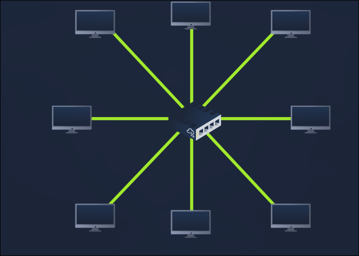
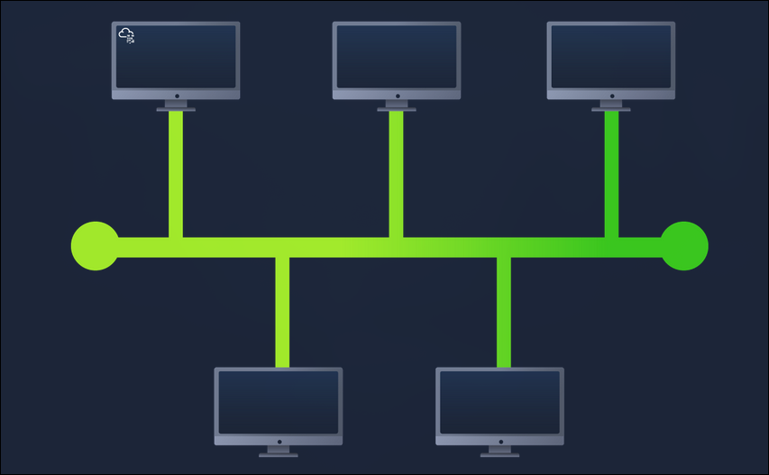
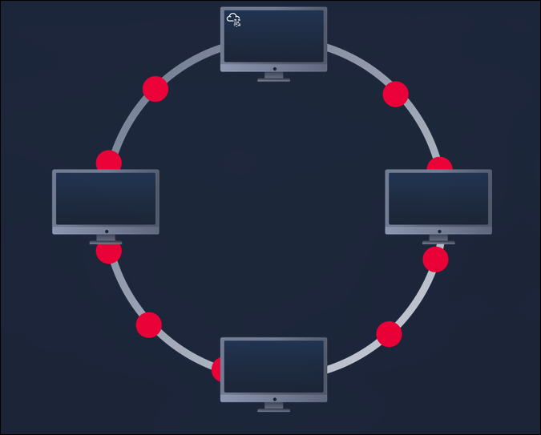
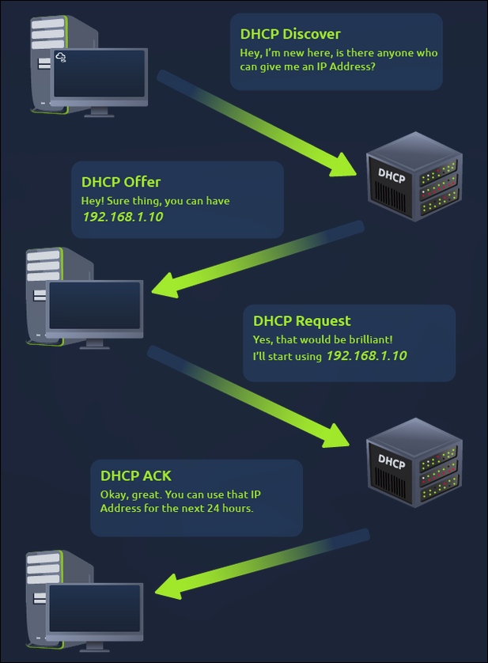

# TryHackMe: Intro To LAN

---

- **Room Link:** [Intro To LAN](https://tryhackme.com/room/introtolan)
- **Category:** Networking / Fundamental
- **Difficulty:** easy

---

## Overview

- Membahas dasar-dasar jaringan kayak Local Area Network (LAN), apa itu Topologi dan jenis-jenisnya (Star, Bus, Ring), serta perangkat jaringan (Switch, Hub, Router)

- Panduan dasar tentang subnetting (membagi jaringan jadi lebih kecil) dan juga ngerti tentang protokol jaringan ARP & DHCP

## Task Summary & Key Concept

### 1. What is a LAN ? (**L**ocal **A**rea **N**etwork)

LAN itu jenis jaringan lokal yang menghubungkan perangkat-perangkat dalam jarak dekat, kayak di rumah, kantor, atau sekolah. LAN bikin perangkat komputer bisa saling berkomunikasi dan berbagi sumber daya kayak upload file dan kirim file dengan kecepatan tinggi. Biayanya juga lebih murah dibanding jenis jaringan lainnya.

### Jenis-Jenis Topologi LAN

- Star Topology (perangkat terhubung secara individu lewat perangkat jaringan pusat kayak switch atau hub) -- paling umum dipake tapi biayanya mahal

- Bus Topology (perangkat terhubung lewat satu kabel yang sama, karena bergantung ke satu koneksi alias kabel backbone) -- biaya murah tapi bakal down kalau banyak perangkat ngirim data secara bersamaan

- Ring Topology (setiap perangkat terhubung ke dua perangkat lainnya, membentuk jalur melingkar. Data dikirim dari satu perangkat ke perangkat lain dalam satu arah sampai nyampe tujuan) -- gampang buat deteksi kesalahan di lalu lintas data, tapi kalau satu perangkat bermasalah maka seluruh jaringan ikut kena dampaknya

### 2. Networking Device

Perangkat yang dipake buat menghubungkan dan ngelola jaringan komputer.

### Contoh-contoh Networking Devices

- **Switch:** Alat yang menghubungkan beberapa perangkat (kayak komputer, printer, atau perangkat lain) ke dalam LAN. Switch pake MAC Address buat ngirim paket data cuma ke perangkat tujuan yang spesifik.

- **Router:** Tugasnya menghubungkan jaringan yang berbeda dan nerusin data antar jaringan lewat proses yang namanya _routing_. Routing itu cara nentuin jalur terbaik buat paket data supaya bisa sampai tujuan dengan sukses.

### ARP (**A**ddress **R**esolution **P**rotocol)

ARP itu protokol buat menghubungkan IP Address dengan MAC Address di jaringan lokal. Waktu sebuah perangkat mau ngirim data ke IP Address tertentu, ARP bakal nyari MAC Address yang cocok. Kalau MAC Address-nya belum ada di tabel ARP, perangkat bakal ngirim permintaan (ARP Request) ke semua perangkat di jaringan. Perangkat yang punya alamat IP yang diminta bakal bales dengan MAC Address-nya, jadi data bisa dikirim ke tujuan yang tepat.

### DHCP (**D**ynamic **H**ost **C**onfiguration **P**rotocol)

DHCP itu protokol jaringan yang secara otomatis ngasih IP Address dan informasi konfigurasi jaringan ke perangkat yang terhubung. DHCP server bakal ngasih IP Address yang tersedia plus info lain kayak subnet mask, gateway, dan DNS.

Proses DHCP server:

**DHCP Discover:** Perangkat ngirim pesan DHCP Discover buat nyari server DHCP yang ada.

**DHCP Offer:** Server DHCP yang nerima pesan dari DHCP Discover bakal ngirim balesan berisi IP Address yang tersedia plus informasi lainnya (DHCP Offer).

**DHCP Request:** Perangkat nerima tawaran IP Address dan ngirim pesan DHCP Request ke server DHCP buat minta IP Address yang ditawarin.

**DHCP ACK:** Server DHCP mengonfirmasi dengan ngirim pesan ACK (Acknowledgment) yang nyatain bahwa perangkat udah dikasih IP Address.
