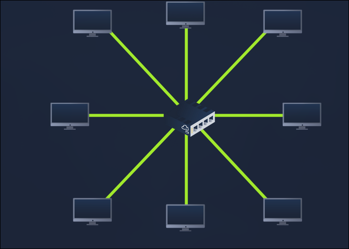
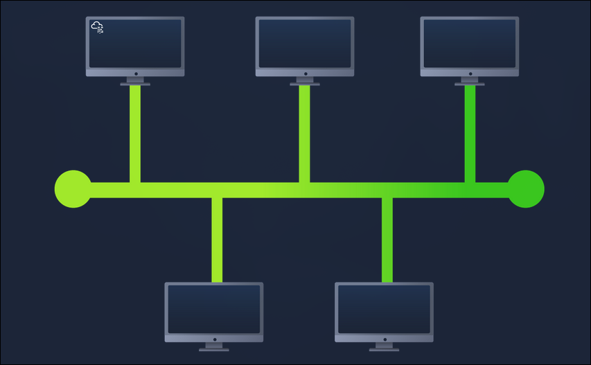
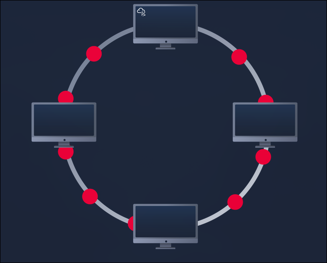
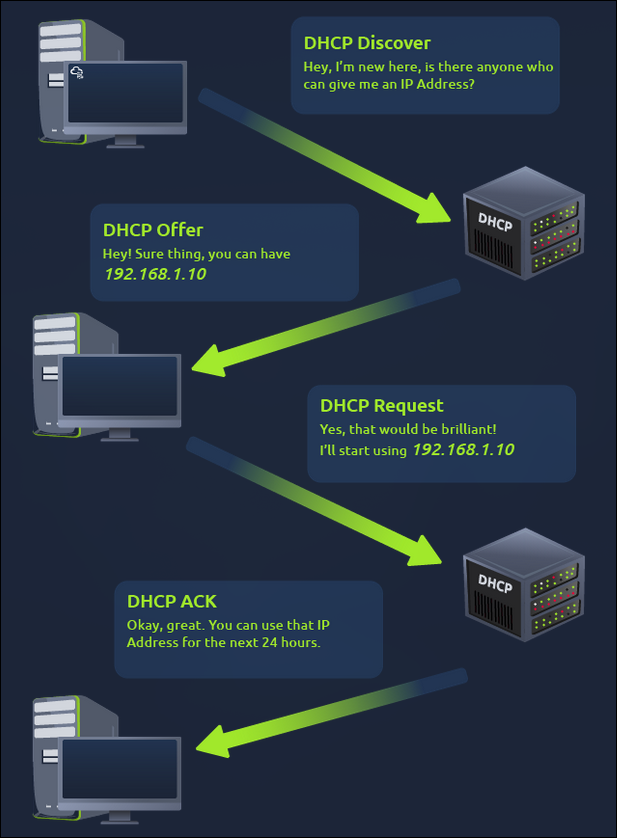

# TryHackMe: Intro To LAN

---

* **Room Link:** [Intro To LAN](https://tryhackme.com/room/introtolan)
* **Category:** Networking / Fundamental
* **Difficulty:** easy

---

## Overview

Room ini membahas dasar-dasar jaringan lokal — apa itu LAN, jenis-jenis topologi, perangkat jaringan, serta protokol ARP dan DHCP.

---

### What is a LAN? (Local Area Network)

**LAN** itu jaringan yang menghubungkan perangkat-perangkat dalam **jarak dekat** — seperti di rumah, kantor, atau sekolah. Analogi: LAN itu ibarat **interkom di gedung** — semua orang di gedung yang sama bisa berkomunikasi langsung dengan cepat dan murah, tapi ga bisa menelepon ke gedung lain tanpa jalur keluar (router/internet).

**Keunggulan LAN:** Kecepatan tinggi, biaya murah, bisa saling berbagi file dan sumber daya.

---

### Jenis-Jenis Topologi LAN

| Topologi | Cara Kerja | Kelebihan | Kekurangan |
| -------- | ---------- | --------- | ---------- |
| **Star** | Perangkat terhubung individu lewat perangkat pusat (switch/hub) | Paling umum, kalau satu kabel putus yang lain ga kena | Biaya lebih mahal, bergantung pada perangkat pusat |
| **Bus** | Semua perangkat terhubung lewat satu kabel backbone | Biaya murah, setup sederhana | Down kalau banyak perangkat kirim data bersamaan |
| **Ring** | Perangkat membentuk jalur melingkar, data dikirim satu arah | Mudah deteksi kesalahan lalu lintas data | Satu perangkat bermasalah = seluruh jaringan terdampak |

---

### Networking Devices

| Perangkat | Analogi | Fungsi |
| --------- | ------- | ------ |
| **Switch** | Resepsionis pintar — tau siapa di meja mana | Menghubungkan beberapa perangkat ke LAN, pakai MAC Address buat kirim data ke tujuan yang tepat |
| **Router** | Google Maps — pilih jalur terbaik antar jaringan | Menghubungkan jaringan berbeda dan meneruskan data lewat proses _routing_ |

---

### ARP (Address Resolution Protocol)

ARP itu protokol untuk menghubungkan **IP Address** dengan **MAC Address** di jaringan lokal. Ketika sebuah perangkat mau mengirim data ke IP tertentu tapi belum tau MAC Address-nya, ARP melakukan broadcast ke seluruh jaringan: Siapa pemilik IP ini? lalu pemiliknya membalas dengan MAC Address-nya.

*(Penjelasan lebih detail tentang ARP ada di catatan [Networking-Essentials](../../Cyber-Security-101/Networking/Networking-Essentials.md))*

---

### DHCP (Dynamic Host Configuration Protocol)

DHCP itu protokol yang **secara otomatis memberi IP Address** dan konfigurasi jaringan ke perangkat yang terhubung (subnet mask, gateway, DNS).

**Proses DORA:**

| Tahap | Yang Terjadi |
| ----- | ------------ |
| **D**iscover | Perangkat mengirim pesan broadcast mencari DHCP server yang tersedia |
| **O**ffer | Server DHCP membalas dengan IP Address yang tersedia + info konfigurasi |
| **R**equest | Perangkat menerima tawaran dan mengirim konfirmasi mau IP tersebut |
| **A**cknowledge | Server mengonfirmasi — perangkat resmi mendapat IP Address |

*(Penjelasan lebih detail tentang DHCP ada di catatan [Networking-Essentials](../../Cyber-Security-101/Networking/Networking-Essentials.md))*
