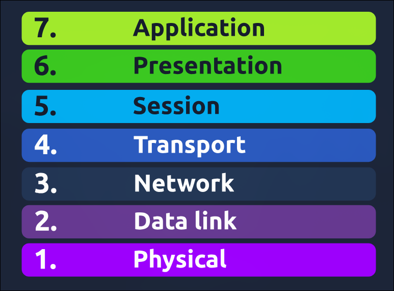

# TryHackMe: OSI Model

**(My favourite Part)**

---

- **Room Link:** [OSI Model](https://tryhackme.com/room/osimodelzi)
- **Category:** Networking / Fundamental
- **Difficulty:** easy

---

---

## Overview

- OSI Model itu kerangka konsep yang bikin sistem komunikasi di jaringan punya bahasa yang sama. Tujuannya buat mastiin sistem bisa saling berkomunikasi pake protokol yang udah disepakati secara global.

### What is OSI Model ?

OSI Model (Open System Interconnection Model) itu kerangka konsep yang membagi jaringan jadi 7 lapisan: Physical, Data Link, Network, Transport, Session, Presentation, Application.

#### 7 layer OSI Model:

---

### Penjelasan setiap Layer OSI Model:

1. **Physical:** Lapisan pertama yang tugasnya ngirim data secara fisik lewat media transmisi kayak kabel ethernet, sinyal listrik, kabel optik, modem, dan antena.

2. **Data Link:** Lapisan kedua yang fokus di pengalamatan fisik transmisi data. Lapisan ini nerima data dari lapisan Network dan nambahin MAC Address supaya perangkat bisa saling kenal. Simpelnya, lapisan ini bantu perangkat yang terhubung ke jaringan biar bisa saling berkomunikasi.

3. **Network:** Lapisan ketiga yang tugasnya ngarahin data dari satu perangkat ke perangkat lain di jaringan yang berbeda. Pake IP Address buat nentuin rute terbaik buat ngirim data di jaringan yang kompleks.

Ada 5 protokol yang aku pelajari:

- **IP (Internet Protocol):** Protokol buat pengalamatan dan pengiriman data di jaringan.
- **ICMP (Internet Control Message Protocol):** Protokol buat ngirim pesan kontrol dan error antar perangkat jaringan.
- **ARP (Address Resolution Protocol):** Protokol yang menghubungkan / menerjemahkan IP Address ke MAC Address.
- **OSPF (Open Shortest Path First):** Protokol _link-state_ yang nentuin jalur tercepat berdasarkan _bandwidth_ (cost). OSPF efisien banget karena punya peta lengkap topologi jaringan.
- **RIP (Routing Information Protocol):** Protokol _distance-vector_ yang pake jumlah lompatan router (**hop count**) buat nentuin jalur terbaik. Protokol ini punya batas maksimal 15 lompatan (hop).

4. **Transport:** Lapisan keempat yang tugasnya ngelola pengiriman data antar perangkat dan mastiin data diterima dengan benar. Unit data di lapisan ini disebut segmen, bukan lagi packet.

Ada 2 protokol di lapisan Transport:

- **TCP (Transmission Control Protocol):** Protokol yang nyediain pengiriman data secara handal dan teratur, menjamin data nyampe ke tujuan dalam urutan yang benar.
- **UDP (User Datagram Protocol):** Protokol yang lebih cepet dari TCP tapi nggak menjamin pengiriman yang handal dan urutan data yang teratur.

| Perbedaan             | TCP (Transmission Control Protocol)      | UDP (User Datagram Protocol)             |
| :-------------------- | :--------------------------------------- | :--------------------------------------- |
| **Keandalan**         | Sangat Handal (Reliable)                 | Tidak Handal (Unreliable)                |
| **Koneksi**           | Connection-oriented                      | Connectionless                           |
| **Kecepatan**         | Lebih Lambat (Banyak proses pengecekan)  | Sangat Cepat (Tanpa hambatan)            |
| **Pengiriman Ulang**  | Mengirim ulang data yang hilang/rusak    | Tidak mengirim ulang data yang hilang    |
| **Urutan Data**       | Data diterima sesuai urutan yang dikirim | Data bisa diterima berantakan/tidak urut |
| **Contoh Penggunaan** | Web (HTTP), Email, Transfer File         | Streaming Video, Game Online, VoIP       |

5. **Session:** Lapisan kelima yang fungsinya ngelola sesi antar 2 perangkat -- menetapkan, mempertahankan, dan mengakhiri koneksi biar aplikasi berkomunikasi dengan lancar. Simpelnya, lapisan ini bantu jaga komunikasi tetap teratur antar aplikasi yang berbeda.

Protokol yang ada di lapisan ini:

- **RPC (Remote Procedure Call):** Protokol ini bikin suatu program bisa minta layanan dari program lain di komputer yang beda jaringan. Intinya nyederhanain komunikasi antar aplikasi tanpa harus ngurusin detail jaringan.
- **SMB (Server Message Block):** Protokol ini dipake buat berbagi file, printer, dan sumber daya lainnya di jaringan. Dengan SMB, kita bisa ngelola dan ngakses data dengan gampang di jaringan tanpa harus pindah tempat.

6. **Presentation:** Lapisan keenam ini jadi penerjemah data biar bisa dipahami sama aplikasi / lapisan ke-7 (Application). Mastiin data disajiin dalam format yang bener supaya bisa diproses dengan baik. Lapisan ini juga yang ngurusin enkripsi dan dekripsi buat keamanan.

7. **Application:** Lapisan ketujuh, yang paling deket sama pengguna. Nyediain layanan jaringan buat aplikasi perangkat lunak kayak web browser (HTTP/HTTPS) atau email.
