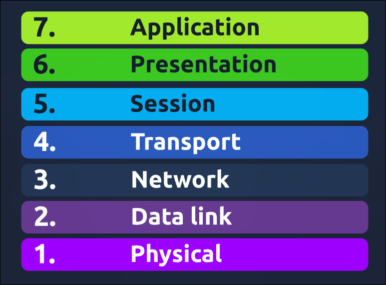

# TryHackMe: OSI Model

**(My favourite Part)**

---

- **Room Link:** [OSI Model](https://tryhackme.com/room/osimodelzi)
- **Category:** Networking / Fundamental
- **Difficulty:** easy

---

## Overview

OSI Model itu kerangka konseptual yang membuat sistem komunikasi di jaringan punya **bahasa yang sama**. Tujuannya memastikan perangkat dari berbagai produsen bisa saling berkomunikasi pakai protokol yang sudah disepakati secara global.

(Ringkasan praktis OSI + TCP/IP ada di catatan [Networking Concepts](file:///home/dimm/CyberSec-Learning-Notes/THM-Notes/Cyber-Security-101/Networking/Networking-Concept.md). Untuk memahami bagaimana data dibungkus per-layer, cek [Packet & Frames](file:///home/dimm/CyberSec-Learning-Notes/THM-Notes/Pre-Security/Networking-fundamental/Packet&Frames.md))

---

### What is OSI Model?

**OSI Model** (Open System Interconnection Model) membagi proses komunikasi jaringan jadi **7 lapisan**. Setiap lapisan punya tugas spesifik — ibarat **jalur produksi di pabrik** di mana setiap stasiun mengerjakan satu bagian sampai produk (data) siap dikirim.

---

### 7 Layer OSI Model

| Layer | Nama | Analogi | Fungsi Utama | Data Unit |
| :---: | ---- | ------- | ------------ | --------- |
| 7 | **Application** | Meja pelayanan (berhadapan langsung dengan kamu) | Menyediakan layanan jaringan ke aplikasi (browser, email) | Data |
| 6 | **Presentation** | Penerjemah bahasa + tukang segel amplop | Encoding, kompresi, enkripsi/dekripsi data | Data |
| 5 | **Session** | Operator telepon (buka-tutup sambungan) | Mengelola sesi komunikasi antar aplikasi | Data |
| 4 | **Transport** | Jasa pengiriman (kilat vs reguler) | Pengiriman data end-to-end, flow control | Segment |
| 3 | **Network** | Pengantar paket (pilih rute antar kota) | Routing, pengalamatan IP | Packet |
| 2 | **Data Link** | Kurir lokal (kirim di satu area) | Pengalamatan fisik (MAC), error detection | Frame |
| 1 | **Physical** | Jalan raya, kabel, truk | Transmisi bit mentah lewat media fisik | Bits |

> **Mnemonic buat menghafal (dari bawah ke atas):** **P**lease **D**o **N**ot **T**hrow **S**pinach **P**izza **A**way

---

### Layer 3: Network — Protokol Penting

| Protokol | Fungsi |
| -------- | ------ |
| **IP** (Internet Protocol) | Pengalamatan dan pengiriman data di jaringan |
| **ICMP** (Internet Control Message Protocol) | Mengirim pesan kontrol dan error antar perangkat |
| **ARP** (Address Resolution Protocol) | Menerjemahkan IP Address ke MAC Address |
| **OSPF** (Open Shortest Path First) | Protokol _link-state_ — menentukan jalur tercepat berdasarkan _bandwidth_. Punya peta lengkap topologi jaringan |
| **RIP** (Routing Information Protocol) | Protokol _distance-vector_ — pakai jumlah lompatan (**hop count**) buat menentukan jalur. Batas maksimal 15 hop |

---

### Layer 4: Transport — TCP vs UDP

| Aspek | **TCP** | **UDP** |
| :---- | :------ | :------ |
| **Analogi** | Telepon (harus tersambung dulu) | Walkie-talkie (langsung bicara) |
| **Keandalan** | Sangat Handal (Reliable) | Tidak Handal (Unreliable) |
| **Koneksi** | Connection-oriented | Connectionless |
| **Kecepatan** | Lebih lambat (banyak pengecekan) | Sangat cepat (tanpa hambatan) |
| **Pengiriman Ulang** | Mengirim ulang data yang hilang/rusak | Tidak mengirim ulang |
| **Urutan Data** | Data diterima sesuai urutan | Data bisa diterima berantakan |
| **Contoh Penggunaan** | Web (HTTP), Email, Transfer File | Streaming Video, Game Online, VoIP |

---

### Layer 5: Session — Protokol Penting

| Protokol | Fungsi |
| -------- | ------ |
| **RPC** (Remote Procedure Call) | Memungkinkan program minta layanan dari program lain di komputer berbeda — menyederhanakan komunikasi antar aplikasi |
| **SMB** (Server Message Block) | Berbagi file, printer, dan sumber daya lainnya di jaringan lokal |

---

### Layer 6: Presentation

Lapisan ini jadi **penerjemah data** — memastikan data disajikan dalam format yang benar agar bisa diproses oleh lapisan Application. Juga menangani enkripsi dan dekripsi buat keamanan.

### Layer 7: Application

Lapisan yang paling dekat sama pengguna. Menyediakan layanan jaringan buat aplikasi seperti web browser (HTTP/HTTPS), email (SMTP), dan transfer file (FTP).
