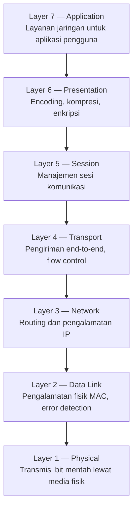
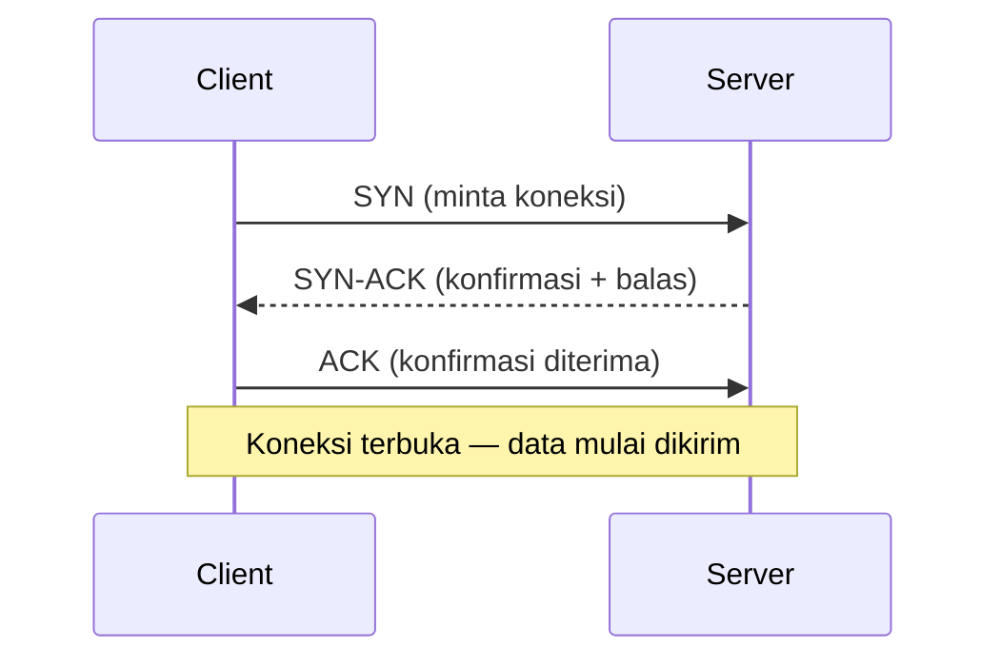

# OSI Model

_Catatan dari TryHackMe | Networking Fundamental — Easy_
_Room: [OSI Model](https://tryhackme.com/room/osimodelzi)_

_(Ringkasan praktis OSI + TCP/IP ada di catatan [Networking Concepts](../Networking-Concept.md). Untuk memahami bagaimana data dibungkus per layer, cek [Packets & Frames](../Packet&Frames.md))_

---

## What is the OSI Model?

**OSI Model** (_Open Systems Interconnection Model_) adalah kerangka konseptual yang membagi proses komunikasi jaringan menjadi **7 lapisan** terpisah. Setiap lapisan memiliki tanggung jawab yang spesifik dan hanya berkomunikasi dengan lapisan di atas dan di bawahnya.

Tujuan utama OSI Model adalah memastikan perangkat dari berbagai produsen yang berbeda bisa saling berkomunikasi menggunakan protokol yang sudah disepakati secara global — selama keduanya mengikuti standar yang sama di setiap layer, mereka bisa bertukar data tanpa masalah.

**Attack Context:**

- **Kapan relevan?** OSI Model menjadi referensi utama saat menganalisis serangan jaringan karena setiap layer memiliki vektor serangan yang berbeda. Memahami di layer mana sebuah serangan terjadi menentukan tools, teknik, dan mitigasi yang tepat.
- **Syarat yang dibutuhkan:** Pemahaman OSI Model adalah prasyarat sebelum mempelajari network exploitation, packet analysis, dan firewall evasion.
- **Tanda keberhasilan:** Mampu mengidentifikasi di layer mana sebuah serangan atau anomali terjadi berdasarkan karakteristik traffic atau behavior yang diamati.

---

## The 7 Layers

```mermaid
graph TD
    L7["Layer 7 — Application\nLayanan jaringan untuk aplikasi pengguna"]
    L6["Layer 6 — Presentation\nEncoding, kompresi, enkripsi"]
    L5["Layer 5 — Session\nManajemen sesi komunikasi"]
    L4["Layer 4 — Transport\nPengiriman end-to-end, flow control"]
    L3["Layer 3 — Network\nRouting dan pengalamatan IP"]
    L2["Layer 2 — Data Link\nPengalamatan fisik MAC, error detection"]
    L1["Layer 1 — Physical\nTransmisi bit mentah lewat media fisik"]

    L7 --> L6 --> L5 --> L4 --> L3 --> L2 --> L1
```

> **for your information:** Proses pengiriman data dari Layer 7 ke Layer 1 disebut **encapsulation** — setiap layer menambahkan header informasinya sendiri ke data. Proses sebaliknya saat data diterima disebut **decapsulation** — setiap layer melepas header miliknya sebelum meneruskan ke layer di atasnya.

**Mnemonic untuk menghafal layer dari bawah ke atas:**
> **P**lease **D**o **N**ot **T**hrow **S**ausage **P**izza **A**way
> _(Physical — Data Link — Network — Transport — Session — Presentation — Application)_

Ringkasan seluruh layer:

| Layer | Nama | Fungsi Utama | Data Unit |
| :---: | :--- | :--- | :--- |
| 7 | **Application** | Menyediakan layanan jaringan langsung ke aplikasi pengguna | Data |
| 6 | **Presentation** | Encoding, kompresi, dan enkripsi/dekripsi data | Data |
| 5 | **Session** | Membuka, mengelola, dan menutup sesi komunikasi antar aplikasi | Data |
| 4 | **Transport** | Pengiriman data end-to-end, flow control, error recovery | Segment |
| 3 | **Network** | Routing antar jaringan dan pengalamatan IP | Packet |
| 2 | **Data Link** | Pengalamatan fisik MAC dan deteksi error di jaringan lokal | Frame |
| 1 | **Physical** | Transmisi bit mentah melalui media fisik | Bits |

---

## Layer 1 — Physical

Layer paling bawah. Bertanggung jawab atas transmisi **bit mentah** (0 dan 1) melalui media fisik — kabel tembaga, kabel fiber optik, atau sinyal radio nirkabel.

Layer ini tidak peduli dengan makna data yang dikirim. Tugasnya hanya satu: memastikan sinyal fisik berhasil berpindah dari satu titik ke titik lain.

**Media transmisi yang umum:**

| Media | Tipe | Karakteristik |
| :--- | :--- | :--- |
| **Twisted Pair (Ethernet)** | Kabel tembaga | Umum dipakai di jaringan lokal, murah, jarak terbatas |
| **Fiber Optic** | Cahaya dalam kabel kaca | Kecepatan tinggi, jarak jauh, tidak rentan interferensi elektromagnetik |
| **Wi-Fi (Radio)** | Sinyal nirkabel | Fleksibel, tapi rentan interferensi dan jangkauan terbatas |

**Serangan yang relevan di Layer 1:**
- **Wiretapping** — penyadapan fisik pada kabel untuk mengintersep transmisi data.
- **Signal jamming** — gangguan sinyal nirkabel untuk memutus koneksi.

---

## Layer 2 — Data Link

Layer 2 bertanggung jawab atas pengiriman data di dalam **jaringan lokal yang sama** — dari satu perangkat ke perangkat lain dalam satu segmen jaringan. Layer ini menggunakan **MAC Address** sebagai identitas fisik setiap perangkat.

> **for your information:** **MAC Address** (_Media Access Control Address_) adalah identitas unik yang ditetapkan secara permanen ke setiap network interface card (NIC) saat diproduksi. Format MAC Address terdiri dari 48 bit yang ditulis dalam notasi heksadesimal, contoh: `00:1A:2B:3C:4D:5E`. Berbeda dengan IP Address yang bisa berubah, MAC Address bersifat tetap di level hardware.

Layer 2 juga melakukan **error detection** — mendeteksi apakah data yang diterima mengalami kerusakan selama transmisi di layer fisik.

**Protokol penting di Layer 2:**

| Protokol | Fungsi |
| :--- | :--- |
| **Ethernet** | Standar komunikasi jaringan kabel lokal yang paling umum digunakan |
| **Wi-Fi (802.11)** | Standar komunikasi jaringan nirkabel lokal |
| **PPP** (_Point-to-Point Protocol_) | Koneksi langsung antara dua perangkat, umum dipakai di koneksi WAN dan dial-up |

**Serangan yang relevan di Layer 2:**
- **ARP Spoofing** — manipulasi tabel ARP untuk mengarahkan traffic ke perangkat penyerang.
- **MAC Flooding** — membanjiri switch dengan MAC Address palsu hingga switch berperilaku seperti hub dan menyiarkan semua frame ke semua port.

---

## Layer 3 — Network

Layer 3 bertanggung jawab atas **routing** — menentukan jalur terbaik untuk mengirimkan data dari jaringan asal ke jaringan tujuan, melewati banyak router di antaranya. Layer ini menggunakan **IP Address** sebagai identitas logis setiap perangkat.

> **for your information:** **Routing** adalah proses menentukan jalur yang dilalui paket data dari sumber ke tujuan melewati jaringan-jaringan yang berbeda. Perangkat yang melakukan routing disebut **router**.

**Protokol penting di Layer 3:**

| Protokol | Fungsi |
| :--- | :--- |
| **IP** (_Internet Protocol_) | Pengalamatan logis dan pengiriman paket antar jaringan |
| **ICMP** (_Internet Control Message Protocol_) | Mengirim pesan kontrol dan laporan error antar perangkat — digunakan oleh tool seperti `ping` dan `traceroute` |
| **ARP** (_Address Resolution Protocol_) | Menerjemahkan IP Address menjadi MAC Address agar data bisa dikirim di level Layer 2 |
| **OSPF** (_Open Shortest Path First_) | Protokol routing _link-state_ yang membangun peta lengkap topologi jaringan dan memilih jalur berdasarkan bandwidth |
| **RIP** (_Routing Information Protocol_) | Protokol routing _distance-vector_ yang menentukan jalur berdasarkan jumlah lompatan (**hop count**) dengan batas maksimal 15 hop |

> **for your information:** **Link-state** adalah pendekatan routing di mana setiap router memiliki peta lengkap seluruh topologi jaringan dan menghitung sendiri jalur terbaik. **Distance-vector** adalah pendekatan di mana setiap router hanya mengetahui jarak ke tetangganya dan meneruskan informasi tersebut — lebih sederhana tapi kurang efisien untuk jaringan besar. **Hop count** adalah jumlah router yang dilewati paket data dari sumber ke tujuan.

**Serangan yang relevan di Layer 3:**
- **IP Spoofing** — memalsukan IP Address sumber pada paket untuk menyembunyikan identitas atau menyamar sebagai host lain.
- **ICMP Flood** — membanjiri target dengan paket ICMP untuk menghabiskan bandwidth dan menyebabkan denial of service.
- **Route Hijacking** — memanipulasi tabel routing untuk mengarahkan traffic melalui jalur yang dikontrol penyerang.

---

## Layer 4 — Transport

Layer 4 bertanggung jawab atas pengiriman data secara **end-to-end** antara dua aplikasi — dari proses di satu host ke proses di host lain. Layer ini mengelola **flow control** (mengatur kecepatan pengiriman agar penerima tidak kewalahan) dan **error recovery** (memastikan data yang hilang atau rusak dikirim ulang).

> **for your information:** **Flow control** adalah mekanisme yang mengatur laju pengiriman data agar pengirim tidak mengirim lebih cepat dari kemampuan penerima untuk memprosesnya. **End-to-end** berarti komunikasi langsung antara aplikasi di dua host yang berbeda, terlepas dari berapa banyak router di antaranya.

### TCP vs UDP

Dua protokol utama di Layer 4 dengan karakteristik yang sangat berbeda:

| Aspek | **TCP** (_Transmission Control Protocol_) | **UDP** (_User Datagram Protocol_) |
| :--- | :--- | :--- |
| **Koneksi** | Connection-oriented — harus membangun koneksi dulu sebelum mengirim data | Connectionless — langsung kirim data tanpa handshake |
| **Keandalan** | Reliable — semua data dijamin sampai dan dalam urutan yang benar | Unreliable — tidak ada jaminan data sampai atau urutannya benar |
| **Pengiriman ulang** | Data yang hilang atau rusak otomatis dikirim ulang | Tidak ada mekanisme pengiriman ulang |
| **Kecepatan** | Lebih lambat karena overhead handshake dan acknowledgment | Lebih cepat karena tidak ada overhead tambahan |
| **Contoh penggunaan** | HTTP/HTTPS, SSH, FTP, Email | DNS, streaming video, game online, VoIP |

> **for your information:** **TCP Three-Way Handshake** adalah proses pembangunan koneksi TCP yang terdiri dari tiga langkah: **SYN** (client meminta koneksi) → **SYN-ACK** (server mengonfirmasi dan membalas) → **ACK** (client mengonfirmasi balasan server). Setelah ini selesai, koneksi resmi terbuka dan data bisa mulai dikirim.

```mermaid
sequenceDiagram
    participant C as Client
    participant S as Server
    C->>S: SYN (minta koneksi)
    S-->>C: SYN-ACK (konfirmasi + balas)
    C->>S: ACK (konfirmasi diterima)
    Note over C,S: Koneksi terbuka — data mulai dikirim
```

**Serangan yang relevan di Layer 4:**
- **SYN Flood** — mengirim banyak paket SYN tanpa pernah menyelesaikan handshake, menghabiskan resource server hingga tidak bisa menerima koneksi baru.
- **Port Scanning** — mengirim paket ke berbagai port untuk mengetahui layanan mana yang aktif di target.

---

## Layer 5 — Session

Layer 5 bertanggung jawab atas **manajemen sesi** — membuka, mempertahankan, dan menutup sesi komunikasi antara dua aplikasi. Layer ini memastikan bahwa jika koneksi terputus di tengah jalan, sesi bisa dilanjutkan dari titik terakhir tanpa harus memulai dari awal.

**Protokol penting di Layer 5:**

| Protokol | Fungsi |
| :--- | :--- |
| **RPC** (_Remote Procedure Call_) | Memungkinkan program pada satu komputer memanggil dan mengeksekusi fungsi pada komputer lain melalui jaringan, seolah fungsi tersebut berjalan secara lokal |
| **SMB** (_Server Message Block_) | Protokol untuk berbagi file, printer, dan sumber daya jaringan lainnya di dalam jaringan lokal |
| **NetBIOS** | Menyediakan layanan sesi dan nama untuk komunikasi antar komputer di jaringan lokal |

**Serangan yang relevan di Layer 5:**
- **Session Hijacking** — mengambil alih sesi yang sudah terautentikasi milik pengguna lain dengan mencuri session token-nya.
- **SMB Exploitation** — mengeksploitasi kerentanan pada protokol SMB, seperti yang dilakukan oleh EternalBlue yang digunakan ransomware WannaCry.

---

## Layer 6 — Presentation

Layer 6 bertanggung jawab atas **format dan representasi data** — memastikan data yang dikirim oleh aplikasi di satu sistem bisa dibaca dengan benar oleh aplikasi di sistem lain, meskipun kedua sistem menggunakan format internal yang berbeda.

Tiga fungsi utama Layer 6:

- **Encoding** — mengubah format data ke representasi standar yang disepakati. Contoh: mengubah karakter teks ke format **ASCII** atau **UTF-8**.
- **Kompresi** — memperkecil ukuran data sebelum dikirim untuk menghemat bandwidth.
- **Enkripsi/Dekripsi** — mengenkripsi data sebelum dikirim dan mendekripsinya saat diterima untuk menjaga kerahasiaan.

> **for your information:** **ASCII** (_American Standard Code for Information Interchange_) adalah standar encoding yang memetakan karakter teks ke nilai numerik. **UTF-8** adalah standar encoding yang lebih modern dan mendukung karakter dari hampir semua bahasa di dunia.

**Protokol dan format penting di Layer 6:**

| Format / Protokol | Fungsi |
| :--- | :--- |
| **SSL/TLS** | Enkripsi data untuk komunikasi yang aman — TLS adalah versi modern SSL |
| **JPEG, PNG, GIF** | Format kompresi dan encoding untuk data gambar |
| **MPEG, MP4** | Format encoding untuk data video |
| **ASCII, UTF-8** | Standar encoding untuk data teks |

**Serangan yang relevan di Layer 6:**
- **SSL Stripping** — memaksa koneksi downgrade dari HTTPS ke HTTP sehingga data dikirim tanpa enkripsi.
- **Encoding Bypass** — memanfaatkan perbedaan cara sistem menginterpretasikan encoding untuk melewati filter keamanan.

---

## Layer 7 — Application

Layer 7 adalah layer yang paling dekat dengan pengguna — ini adalah layer di mana aplikasi berinteraksi langsung dengan jaringan. Layer ini menyediakan layanan jaringan yang digunakan langsung oleh software seperti browser, email client, dan aplikasi lainnya.

**Protokol penting di Layer 7:**

| Protokol | Fungsi |
| :--- | :--- |
| **HTTP/HTTPS** (_Hypertext Transfer Protocol_) | Transfer halaman web antara browser dan web server |
| **DNS** (_Domain Name System_) | Resolusi nama domain ke IP Address |
| **SMTP** (_Simple Mail Transfer Protocol_) | Pengiriman email dari client ke server atau antar server |
| **FTP** (_File Transfer Protocol_) | Transfer file antara client dan server |
| **SSH** (_Secure Shell_) | Remote access terenkripsi ke sistem lain |
| **DHCP** (_Dynamic Host Configuration Protocol_) | Pemberian IP Address otomatis ke perangkat yang bergabung ke jaringan |

**Serangan yang relevan di Layer 7:**
- **SQL Injection** — menyisipkan query SQL berbahaya melalui input aplikasi untuk memanipulasi database.
- **Cross-Site Scripting (XSS)** — menyisipkan script berbahaya ke halaman web yang kemudian dieksekusi di browser pengguna lain.
- **DNS Spoofing** — memanipulasi respons DNS untuk mengarahkan pengguna ke server palsu.
- **Brute Force Login** — mencoba kombinasi kredensial secara masif pada halaman autentikasi.

---

## OSI Layer Attack Map

Ringkasan vektor serangan per layer:

| Layer | Nama | Contoh Serangan |
| :---: | :--- | :--- |
| 7 | Application | SQL Injection, XSS, DNS Spoofing, Brute Force |
| 6 | Presentation | SSL Stripping, Encoding Bypass |
| 5 | Session | Session Hijacking, SMB Exploitation |
| 4 | Transport | SYN Flood, Port Scanning |
| 3 | Network | IP Spoofing, ICMP Flood, Route Hijacking |
| 2 | Data Link | ARP Spoofing, MAC Flooding |
| 1 | Physical | Wiretapping, Signal Jamming |

---

## Quick Review

- Saat seorang attacker menjalankan `ping` flood ke target, di layer berapa serangan tersebut terjadi dan protokol apa yang dieksploitasi?
- Apa perbedaan mendasar antara TCP dan UDP dari sisi keandalan — dan kenapa UDP tetap dipakai meskipun tidak reliable?
- Jelaskan kenapa ARP Spoofing bisa menjadi titik awal untuk serangan Man-in-the-Middle di jaringan lokal.
