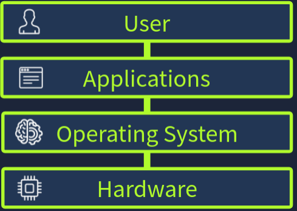
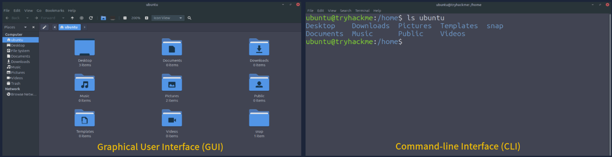

# TryHackMe: Operating Systems Introduction

- **Room Link:** [Operating Systems Introduction](https://tryhackme.com/room/introtoos)
- **Category:** Pre-Security
- **Difficulty:** Easy

---

## Introduction

Setiap hari kamu menyalakan laptop atau HP, dan semuanya langsung *just works*,  aplikasi terbuka, file bisa diakses, musik bisa diputar. Tapi pernahkah kamu berpikir, siapa yang sebenarnya mengatur semua itu di balik layar?

Di room Computer Fundamentals sebelumnya, kamu sudah belajar soal komponen fisik komputer dan jenis-jenis perangkat komputasi. Sekarang saatnya membongkar lapisan tak terlihat yang menyatukan semua komponen itu menjadi satu kesatuan yang bisa kamu pakai: **Operating System** (OS).

### Scenario

Temanmu baru saja meng-upgrade PC nya dan memberikan laptop lamanya ke kamu secara gratis, laptopnya sudah lama tidak dipakai, dan dia cuma ingat laptopnya masih bisa nyala. Sebelum kamu memutuskan mau di-upgrade, di wipe, dijual, atau dijadikan proyek baru, kamu perlu tahu dulu apa yang sedang kamu hadapi, dan itu dimulai dari memahami OS-nya.

### Learning Objectives

Setelah menyelesaikan room ini, kamu akan paham:
- Apa itu **Operating System** dan peran utamanya dalam sebuah komputer.
- Apa saja tugas inti yang dijalankan oleh sebuah OS.
- Jenis-jenis OS yang umum dipakai dan kapan masing-masing cocok digunakan.
- Bagaimana cara berinteraksi dengan OS untuk menggali informasi sistem.

---

## The Invisible Manager

### What is an Operating System?

**Operating System** (OS) adalah software inti yang mengkoordinasi seluruh aktivitas di dalam komputer. OS duduk di antara **user**, **aplikasi**, dan **hardware fisik** — berperan sebagai manajer tak terlihat yang menjaga agar semuanya berjalan sebagai satu kesatuan.

Susunan lapisannya seperti ini:

Kenapa kita butuh OS? Karena tanpanya, setiap aplikasi harus mengakses CPU, memory, file, perangkat, dan keamanan secara langsung, dan pasti bakal bentrok satu sama lain. OS hadir sebagai pengatur pusat yang mencegah kekacauan itu.

Cara paling gampang memahaminya: bayangkan komputermu sebagai **bandara yang sibuk**.

- **Hardware** (CPU, RAM, storage) = landasan pacu, pesawat, radar, dan infrastruktur fisik bandara.
- **Aplikasi** (browser, game, music player) = maskapai penerbangan dan penumpangnya, yang semuanya ingin lepas landas, mendarat, dan meminta layanan.
- **Operating System** = **seluruh sistem kontrol lalu lintas udara (ATC)**. OS yang menjadwalkan, mengarahkan, menyelesaikan konflik antar pesawat, dan memastikan keselamatan seluruh operasi bandara.

Tanpa ATC, pesawat-pesawat itu akan saling tabrak di landasan. Tanpa OS, aplikasi-aplikasimu akan saling rebutan resource dan membuat sistem *crash*.

---

### System Privilege Layers

Di dalam komputer, tidak semua bagian sistem punya level akses yang sama. Ada pemisahan yang dibuat secara sengaja untuk mencegah konflik dan menjaga keamanan:

- **Kernel Space**: Area yang sangat terbatas di mana **kernel** (inti dari OS) berjalan. Kernel punya akses penuh dan langsung ke CPU, memory, storage, dan semua hardware. Hanya komponen terpercaya yang boleh beroperasi di sini.

- **User Space**: Area tempat semua aplikasi standar berjalan. Aplikasi di user space **sengaja dilarang** mengakses hardware secara langsung. Kalau mereka butuh membuka file, menyimpan data, atau mengakses jaringan, mereka harus mengirim permintaan melalui **system call** ke kernel, dan kernel yang akan mengeksekusi permintaan tersebut atas nama aplikasi.

Kembali ke analogi bandara: **kernel space** itu seperti menara kontrol (ATC tower) — area yang sangat terbatas dan hanya petugas ATC terpercaya yang boleh masuk. Sementara itu, **user space** itu seperti maskapai dan penumpang di area terminal. Mereka tidak boleh masuk ke menara kontrol atau menyentuh peralatan langsung. Kalau mereka butuh sesuatu (izin lepas landas, perubahan rute), mereka harus menghubungi menara lewat radio — dan itulah **system call**.

Pemisahan ini krusial karena menjaga OS tetap stabil: satu aplikasi yang bermasalah tidak akan bisa merusak keseluruhan sistem, sama seperti satu maskapai yang bermasalah tidak bisa meruntuhkan operasi seluruh bandara tanpa kendali dari menara ATC.

---

### Operating System Duties

Sekarang kamu sudah paham apa itu OS dan bagaimana privilege-nya dipisahkan. Saatnya melihat tugas-tugas inti apa saja yang dijalankan OS di balik layar agar komputermu bisa berjalan dengan aman, efisien, dan konsisten.

| Tanggung Jawab | Yang Dilakukan OS | Contoh |
| :--- | :--- | :--- |
| **Process Management** | Membuat, menjadwalkan, memprioritaskan, dan menghentikan program yang sedang berjalan. OS yang menentukan berapa banyak waktu CPU yang didapat setiap proses agar *multitasking* terasa mulus. | Membuka browser, music player, dan media sosial bersamaan tanpa komputer *freeze*. |
| **Memory Management** | Mengalokasikan **RAM** (*Random Access Memory* — memori utama yang dipakai untuk menyimpan data sementara selagi program berjalan) ke setiap proses, melindunginya dari proses lain, dan merebut kembali memori saat aplikasi ditutup. Kalau RAM mulai penuh, OS memakai **virtual memory** untuk menjaga stabilitas. | Membuka banyak aplikasi sekaligus — OS memastikan masing-masing mendapat jatah RAM sendiri dan tidak saling mengganggu. |
| **File System Management** | Mengorganisir file ke dalam folder, menangani penamaan, path, permissions, dan metadata (nama, ukuran, tipe, timestamp). | Membuat folder baru, menyimpan foto, atau mengatur file menjadi "read only". |
| **User Management** | Mengelola banyak akun pengguna, proses autentikasi, dan permission untuk menentukan siapa yang boleh mengakses apa. | Login dengan password milikmu dan file-filemu tidak bisa diakses oleh akun user lain. |
| **Device Management** | Memuat driver dan menyediakan antarmuka universal (**Hardware Abstraction Layer**) sehingga aplikasi cukup memerintahkan "cetak ini" atau "putar suara ini" tanpa perlu tahu detail hardware-nya. | Mencolokkan mouse baru, printer, atau hard drive eksternal — dan langsung bisa dipakai. |

> **for your information:**
> **Virtual memory** — mekanisme di mana OS "meminjam" sebagian ruang storage (hard disk/SSD) untuk berpura-pura menjadi RAM tambahan saat RAM fisik sudah penuh.
> **Hardware Abstraction Layer (HAL)** — lapisan software yang menyembunyikan perbedaan hardware dari aplikasi, sehingga satu perintah yang sama bisa berjalan di berbagai perangkat tanpa modifikasi.

---

### Operating System Security

Sebelum antivirus, *firewall*, atau tool keamanan apapun dipasang, OS sudah menjalankan mekanisme proteksi dasarnya sendiri. Ini adalah fondasi keamanan yang selalu aktif:

- **Authentication**: Memverifikasi identitas pengguna melalui password, PIN, atau biometrik.
- **Permissions**: Mengontrol secara persis apa yang boleh dilakukan oleh setiap user dan aplikasi — membaca, menulis, atau mengeksekusi file.
- **Isolation**: Memisahkan setiap proses ke dalam "kotak" terisolasinya sendiri (ingat pemisahan kernel space dan user space). Satu proses yang rusak tidak akan bisa menjatuhkan proses lain.
- **System Protection**: Menjaga file-file sistem yang kritikal dan pengaturan penting dari perubahan yang tidak sah.

---

## OS Interaction and Landscape

### OS Interfaces

Sekarang kamu sudah paham apa itu OS dan apa saja tanggung jawabnya. Pertanyaan berikutnya: bagaimana cara kamu berinteraksi dengan OS itu sendiri? Ada dua cara utama:

#### Graphical User Interface (GUI)

**GUI** adalah antarmuka yang paling sering kamu jumpai sehari-hari. Semua informasi ditampilkan secara visual: ikon folder, jendela aplikasi, menu pengaturan. Kamu cukup klik, drag, dan scroll untuk melakukan sesuatu.

Analoginya seperti aplikasi navigasi di HP. Kamu tinggal mengetuk ikon lokasi tujuan, dan aplikasi yang mencarikan rute-nya untuk kamu. Tidak perlu mengetik apapun.

#### Command-Line Interface (CLI)

**CLI** (_Command-Line Interface_) adalah antarmuka berbasis teks. Alih-alih mengklik ikon, kamu mengetik perintah spesifik yang langsung dipahami oleh sistem. CLI memberikan presisi, kontrol, dan kecepatan yang jauh lebih tinggi dibanding GUI, terutama untuk tugas-tugas tingkat lanjut. Tapi konsekuensinya: kamu harus hafal sintaks perintahnya.

Kembali ke analogi navigasi: kalau GUI itu mengetuk lokasi di peta, maka CLI itu seperti memasukkan **koordinat GPS secara manual**. Hasilnya lebih akurat, tapi kamu harus tahu persis koordinat yang benar.

Pada screenshot di atas, GUI dan CLI sama-sama dipakai untuk menampilkan isi direktori `home` milik user `ubuntu`. GUI membutuhkan beberapa klik navigasi folder, sedangkan CLI cukup satu perintah untuk menampilkan hasil yang sama.

> **for your information:** Nanti di bagian selanjutnya, kamu akan belajar perintah-perintah CLI di Linux dan Windows untuk menavigasi file, memeriksa informasi sistem, dan berinteraksi dengan OS secara langsung.

---

### The Operating System Landscape

Tidak semua OS itu sama. Perangkat yang berbeda dengan pekerjaan yang berbeda membutuhkan desain OS yang berbeda pula. Dari HP di kantongmu sampai web server di data center, ada lima kategori besar OS yang akan kamu temui:

| Tipe OS | Kegunaan Utama | Karakteristik |
| :--- | :--- | :--- |
| **Desktop** | Komputer pribadi, pekerjaan harian, gaming, pembuatan konten | Antarmuka grafis yang kaya, menjalankan banyak aplikasi sekaligus, berfokus pada pengalaman user |
| **Server** | Web hosting, database, layanan cloud, back-end | Tanpa GUI (headless), mengutamakan uptime maksimal, multi-user, akses remote |
| **Mobile** | Smartphone dan tablet | UI berbasis sentuhan, hemat daya, selalu terhubung ke jaringan, sandbox antar aplikasi |
| **Embedded** | Perangkat IoT, smart TV, router, mobil | Ukuran sangat kecil (tiny footprint), berjalan di hardware yang terbatas |
| **Virtual/Cloud** | Virtual machine, container, instance cloud | Ringan, scalable, bisa di-deploy dalam hitungan detik |

---

### Real World Operating Systems

Sekarang kamu tahu kategori-kategorinya. Saatnya melihat OS apa saja yang benar-benar dipakai di dunia nyata, dikelompokkan berdasarkan kategori di atas.

#### Desktop

- **Windows**: OS desktop paling banyak digunakan di dunia. Versi yang beredar saat ini: *Windows 10 (end-of-life)*, *Windows 11*.
- **macOS**: OS desktop buatan Apple, dikenal karena GUI-nya yang smooth dan integrasinya dengan ekosistem Apple. Versi: *Sonoma (14)*, *Sequoia (15)*, *Tahoe (26)*.
- **Linux**: Bukan satu OS tunggal, tapi **keluarga besar** OS open-source yang disebut **distribusi** (distro). Contoh: *Ubuntu*, *Debian*, *Fedora*, *Arch*.

#### Server

- **Windows Server**: Dipakai di jaringan besar, data center, dan lingkungan enterprise. Versi: *Server 2016*, *2019*, *2022*, *2025*.
- **Linux Server**: Mendominasi mayoritas web server di dunia karena keandalan dan sifat open-source-nya. Distro populer: *Ubuntu Server*, *Debian*, *CentOS*, *Red Hat*.
- **Unix**: Dipakai oleh perusahaan besar di sektor keuangan, telekomunikasi, dan pemerintahan. Contoh: *IBM AIX*, *Oracle Solaris*.

#### Mobile

- **Android**: OS mobile paling banyak dipakai di dunia, berjalan di ponsel, tablet, dan perangkat pintar. Versi: *Android 14 - 16* serta varian dari masing-masing produsen.
- **iOS**: OS mobile milik Apple yang berjalan di iPhone, iPad, dan perangkat Apple lainnya. Versi: *iOS 17*, *18*, *26*.

#### Embedded and IoT Devices

- **Embedded Linux**: OS khusus yang ditanamkan langsung ke dalam perangkat dengan fungsi spesifik. Contoh: *OpenWrt* (untuk router), *Ubuntu Core*, *Yocto Project*.
- **Real-Time OS (RTOS)**: Dirancang untuk aplikasi yang membutuhkan waktu respons yang terjamin, seperti kendali pesawat terbang atau sistem medis. Contoh: *FreeRTOS*, *VxWorks*, *QNX*.

> **for your information:** **RTOS** (_Real-Time Operating System_) — OS yang menjamin sebuah tugas akan selesai dalam batas waktu tertentu. Berbeda dengan OS biasa di mana sedikit keterlambatan masih bisa ditoleransi, di RTOS keterlambatan bisa berakibat fatal (bayangkan sistem rem otomatis mobil yang telat merespons).

#### Virtual and Cloud

- **Cloud/VM OS**: OS yang berjalan di data center besar untuk hosting website, aplikasi, dan layanan streaming. Contoh: *Ubuntu LTS*, *Amazon Linux*, *Rocky Linux*.
- **Container-optimized OS**: Alternatif ringan dari VM yang hanya membungkus aplikasi beserta dependensinya. Contoh: *Alpine Linux*, *Bottlerocket AWS*, *Flatcar Linux*.

---

### Why So Many Operating Systems?

Kenapa tidak ada satu OS saja yang bisa dipakai untuk semua perangkat? Jawabannya sederhana: setiap lingkungan punya kebutuhan yang berbeda.

- Laptop harus **mudah dipakai** dan mendukung multitasking berat.
- Server harus stabil, aman, dan mampu berjalan **terus-menerus tanpa gangguan**.
- Perangkat mobile harus **hemat daya** dan terintegrasi erat dengan hardware-nya.
- Embedded system harus **sangat ringan** dan berjalan di hardware yang terbatas.

Perusahaan dan komunitas yang mengembangkan OS ini pun punya tujuan berbeda-beda. Ada yang mengutamakan kemudahan, ada yang fokus ke performa, ada yang mengedepankan keamanan, ada yang sepenuhnya open-source. Karena setiap lingkungan menghargai kapabilitas yang berbeda, tidak ada satu OS yang sempurna untuk semua situasi. Yang ada adalah **ekosistem** OS yang terus berevolusi sesuai kebutuhan masing-masing.

---

## Conclusion

Di room ini kamu sudah melihat apa yang sebenarnya dilakukan OS di balik layar: mengelola privilege, mengatur memory, menangani user, dan menjaga proses-proses tetap berjalan tanpa saling mengganggu. Kamu juga sudah melihat bagaimana bermacam-macam OS lahir karena kebutuhan yang berbeda-beda, mulai dari desktop, server, mobile, embedded, hingga cloud.

### Key Terminology

Sebelum lanjut ke room berikutnya, pastikan kamu paham istilah-istilah inti berikut:

| Istilah | Definisi |
| :--- | :--- |
| **Operating System (OS)** | Software inti yang mengelola hardware, aplikasi, dan seluruh sumber daya sistem. |
| **Kernel Space** | Area dengan privilege tertinggi di dalam OS, tempat kernel berjalan dan mengakses hardware secara langsung. |
| **User Space** | Area tempat aplikasi biasa berjalan dengan permission terbatas, demi keamanan dan stabilitas sistem. |
| **GUI** (*Graphical User Interface*) | Antarmuka visual (ikon, jendela, menu) yang memungkinkan interaksi lewat klik dan sentuh. |
| **CLI** (*Command-Line Interface*) | Antarmuka berbasis teks yang memberikan kontrol presisi melalui perintah yang diketik manual. |

### Further Learning

Di room-room selanjutnya, kamu akan menyelam lebih dalam ke OS Windows dan Linux, belajar menavigasi file system, menggali informasi sistem, dan berinteraksi langsung dengan OS lewat GUI maupun CLI:

- [Windows Basics](https://tryhackme.com/room/windowsbasics)
- [Linux CLI Basics](https://tryhackme.com/room/linuxclibasics)
- [Windows CLI Basics](https://tryhackme.com/room/windowsclibasics)
