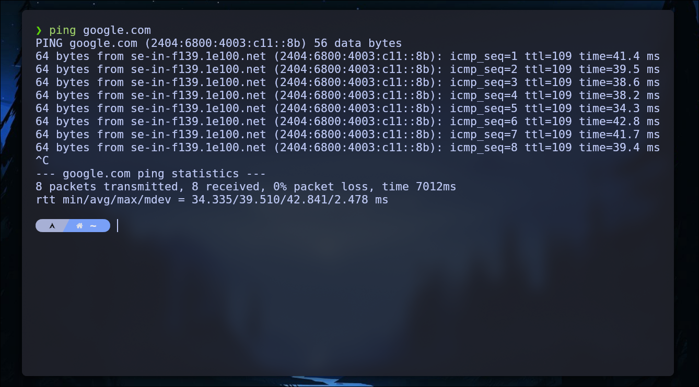

# TryHackMe: What Is Networking?


---

* **Room Link:** [What Is Networking](https://tryhackme.com/room/whatisnetworking)
* **Category:** Networking / Fundamental
* **Difficulty:** easy

---

## Overview

Room ini membahas fundamental paling dasar tentang apa itu networking, identitas perangkat di jaringan, dan cara menguji konektivitas.

---

### What is Networking?

**Networking** itu proses menghubungkan komputer atau perangkat lain supaya bisa saling berkomunikasi dan berbagi sumber daya, Bayangkan **sistem pos** — setiap rumah (perangkat) punya alamat, dan ada infrastruktur jalan + kantor pos (switch, router, kabel) yang memastikan surat (data) sampai ke tujuan yang benar.

**Dimana jaringan bisa ditemukan?** Di mana-mana — rumah, kantor, sekolah, fasilitas umum, sistem transportasi, jaringan listrik, dan tentunya internet itu sendiri.

**Simulasi WiFi Hotel (dari room ini):**

| Pengguna | Kondisi | Hasil |
| -------- | ------- | ----- |
| **User 1** | Sudah bayar layanan WiFi | Router mengizinkan dan mengirim data lancar |
| **User 2** | Belum bayar layanan WiFi | Setiap permintaan data ditolak oleh router |

---

### Identitas di Jaringan

Agar data sampai ke tujuan yang tepat, setiap perangkat butuh **identitas**. Ada dua jenis:

#### IP Address (Internet Protocol Address)

IP Address itu ibarat **alamat rumah** — deretan angka yang dipakai buat mengidentifikasi perangkat di jaringan.

| Versi | Format | Kapasitas | Contoh |
| ----- | ------ | --------- | ------ |
| **IPv4** | 4 oktet, 32-bit | ~4,3 miliar alamat | `192.168.1.1` |
| **IPv6** | 8 kelompok heksadesimal, 128-bit | Hampir tak terbatas | `2001:0db8:85a3:0000:0000:8a2e:0370:7334` |

#### MAC Address (Media Access Control Address)

MAC Address itu ibarat **nomor seri akta kelahiran** — identitas fisik yang permanen dan unik, sudah ditentukan oleh pabrik sejak perangkat diproduksi.

| Aspek | Detail |
| ----- | ------ |
| **Format** | 48-bit, 12 karakter heksadesimal dipisah titik dua (`:`) |
| **Contoh** | `A4:C3:F0:85:AA:D3` |
| **Sifat** | Permanen (tapi bisa di-spoof untuk keperluan pentesting) |

---

### Ping (ICMP)

**Ping** itu salah satu tool jaringan paling dasar — ibarat **mengetuk pintu rumah seseorang** untuk mengecek apakah mereka ada di rumah.

Ping menggunakan paket **ICMP** (Internet Control Message Protocol) untuk:
* Mendiagnosis masalah konektivitas
* Mengukur latensi jaringan (seberapa cepat respon)
* Menentukan apakah perangkat bisa dijangkau

```bash
ping google.com
```

<p align="center">

</p>

Di gambar di atas, ping ke `google.com` menghasilkan respon IPv6 dengan waktu sekitar 39.4 ms per paket.
