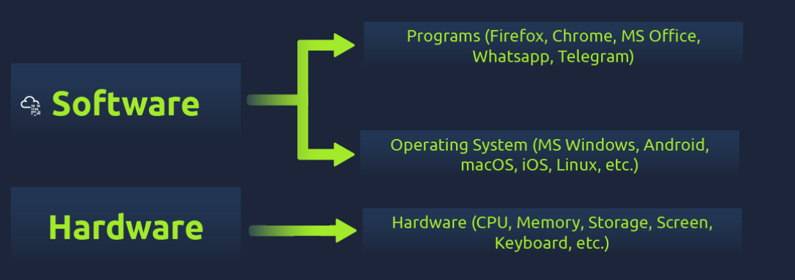
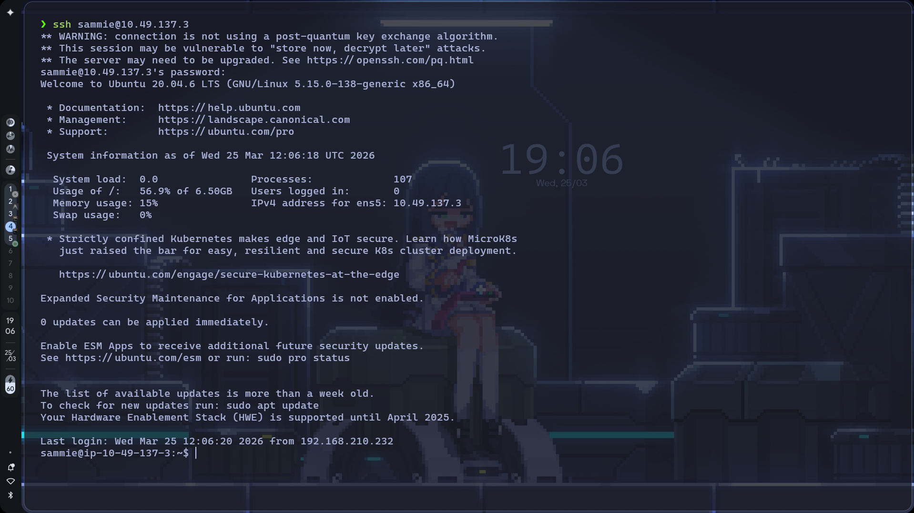
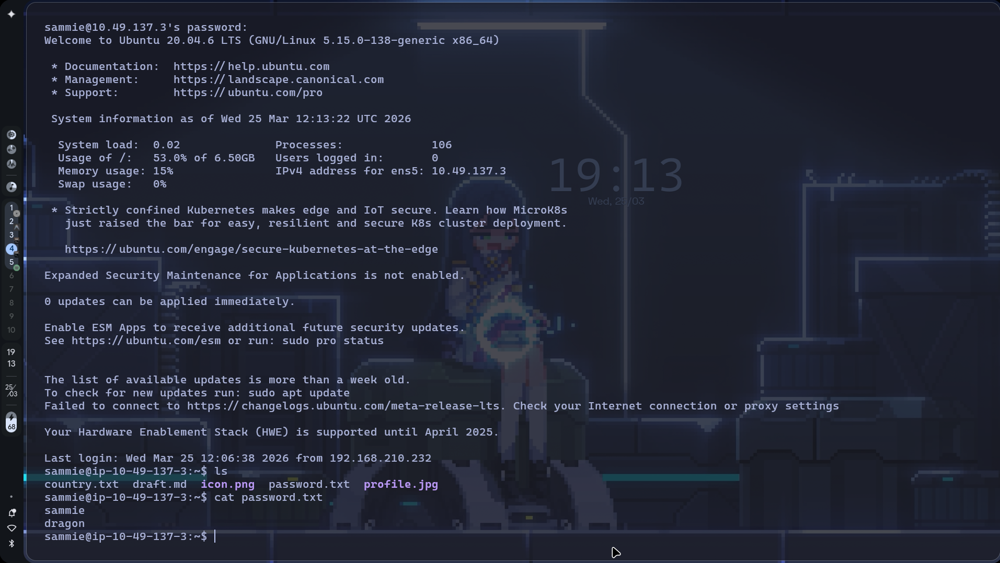
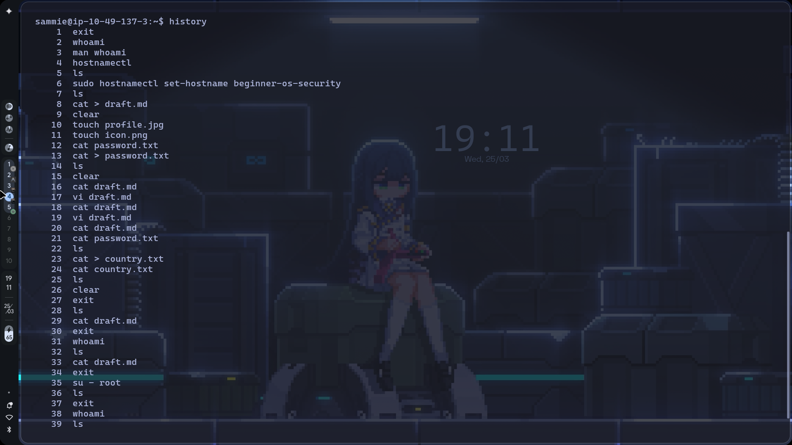
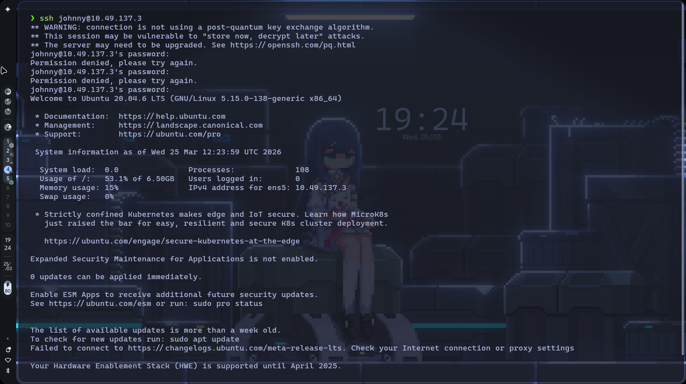
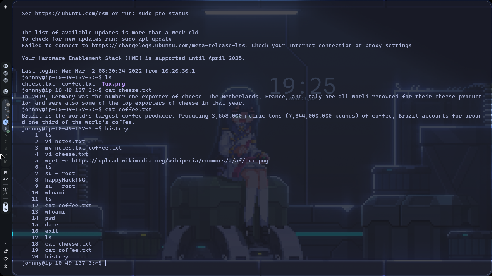
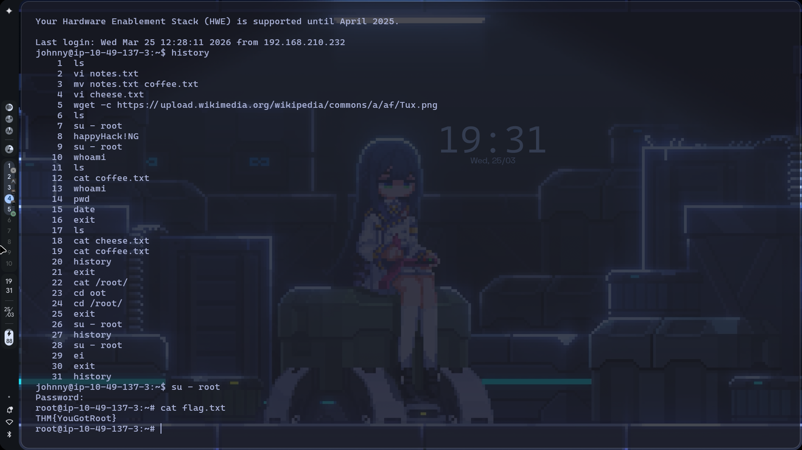
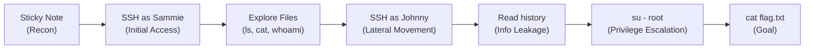

# TryHackMe: Operating System Security

- **Room Link:** [Operating System Security](https://tryhackme.com/room/operatingsystemsecurity)
- **Category:** Pre-Security / Operating System Basics
- **Difficulty:** Easy

_(Prerequisite: Operating Systems Introduction, Windows Basics, Linux & Windows CLI Basics)_

## Introduction to Operating System Security

Setiap hari, sadar atau tidak, kamu berinteraksi dengan Sistem Operasi (Operating System/OS) entah itu Windows, macOS, Linux, iOS, atau Android di _smartphone_ mu. Tapi, apa sebenarnya peran sebuah sistem operasi? Untuk menjawabnya, kamu perlu mengingat kembali konsep tentang _hardware_.

### Hardware Vs Software (OS)

_Hardware_ adalah semua komponen fisik komputer yang bisa kamu sentuh seperti layar, keyboard, USB flash drive, dan terutama _desktop board_ (motherboard). Papan sirkuit utama ini memuat **CPU** (_Central Processing Unit_), memori **RAM** (_Random Access Memory_), dan terhubung ke penyimpanan permanen seperti HDD atau SSD.

Namun, semua perangkat keras secanggih apa pun hanyalah benda mati, komponen-komponen tersebut tidak berguna sampai ada sistem operasi yang mengontrol dan menggerakkan (_drive_) alat-alat tersebut agar program favoritmu bisa berjalan.



Diagram di atas dengan jelas menunjukkan hierarki sistem komputer. **OS adalah lapisan penerjemah / pembatas** yang berada di antara hardware dan aplikasi.

Program-program seperti *web browser* (Firefox, Chrome) atau aplikasi *chatting* (WhatsApp, Telegram) **tidak bisa dan tidak boleh** mengakses alat hardware secara langsung. Aplikasi harus meminta izin pada OS, dan OS-lah yang akan memberinya jalur akses ke hardware sesuai dengan aturan (_rules_) yang sangat spesifik.

> **for your information:** Ada banyak variasi OS. Sebagian dirancang khusus untuk laptop/PC (Windows 11, macOS), sebagian untuk mobile (Android, iOS), dan ada pula yang khusus spesialis infrastruktur *server* perusahaan berskala besar (Windows Server 2022, IBM AIX, Oracle Solaris). **Linux** merajai dua ranah tersebut sekaligus, andalan di Server perkantoran modern namun nyaman untuk desktop harian.

### The Need for Security

Mengapa OS perlu diamankan dengan ketat? Karena komputer dan smartphone modern menyimpan segudang informasi pribadimu:
1. File rahasia terkait pekerjaan atau perkuliahan.
2. Foto-foto pribadi, atau foto dokumen identitas seperti KTP/Paspor.
3. Klien Email yang berisi korespondensi bisnis.
4. Data Sandi (*Passwords*) yang otomatis tersimpan di dalam _browser_.
5. Aplikasi perbankan elektronik dan finansial.

Tentu saja, kamu tidak akan membiarkan orang tak dikenal membuka pintu rumahmu dan mengacak-acak lacimu. Konsep ini berlaku juga untuk perangkatmu. Mengamankan file dan OS-nya adalah esensi utama dari Cyber Security.

### The CIA Triad

Saat para profesional keamanan siber berbicara tentang melindungi data, fokus utama mereka akan selalu berpusat pada tiga prinsip mendasar, yang dikenal luas sebagai **CIA Triad**:

| Pilar | Deskripsi |
| :--- | :--- |
| **Confidentiality** (Kerahasiaan) | Memastikan file rahasia dan informasi privat **hanya** bisa diakses oleh entitas atau orang yang benar-benar berhak. |
| **Integrity** (Integritas) | Memastikan **tidak ada pihak tak berizin** yang memodifikasi, merusak, atau menyisipkan *malware* (_tamper_) ke dalam file yang tersimpan di sistem maupun data yang sedang berpindah jalur di jaringan. |
| **Availability** (Ketersediaan) | Memastikan laptop, sistem, atau perangkatmu selalu **siap dan tanggap beroperasi kapan saja** kamu memutuskan untuk memakainya. |

Semua *attacks* (serangan siber) yang akan dibahas selanjutnya dirancang untuk menjebol, merusak, atau menumbangkan setidaknya salah satu dari tiga pilar keamanan fundamental ini.

---

## Common Examples of OS Security

Seperti sudah dibahas pada pilar keamanan CIA, segala bentuk pengamanan (*security*) pada intinya bertugas untuk mengatasi berbagai kelemahan sistem. Di task ini kitalah yang mendalami tiga celah utama yang selalu dicari dan dieksploitasi oleh penyerang (*attacker*) dan pengguna jahat.

1.  **Authentication and Weak Passwords**
2.  **Weak File Permissions**
3.  **Malicious Programs**

### 1. Authentication and Weak Passwords

Autentikasi (_authentication_) adalah tindakan untuk membuktikan dan memvalidasi **identitas aslimu** saat mengakses sebuah sistem, baik lokal di depan keyboardmu maupun secara _remote_ dari jaringan jarak jauh. Metode autentikasi umumnya dikategorikan menjadi tiga bentuk:

-   **Something you know:** Sesuatu yang berada di kepalamu. Contoh: *password* akun atau nomor PIN bank.
-   **Something you are:** Karakteristik biologis atau ciri fisikmu yang unik. Contoh: biometrik seperti sensor sidik jari (*fingerprint*) dan deteksi wajah (*Face ID*).
-   **Something you have:** Barang, objek fisik, atau token _hardware_ yang berada di genggamanmu saat _login_. Contoh: SMS kode *OTP* (menggunakan nomor _smartphone_), _authenticator app_, atau kunci fisik USB Yubikey.

Di antara ketiga jenis tersebut, sistem kata sandi (*passwords*) adalah sistem yang pembuatannya paling murah, banyak digunakan di setiap pendaftaran layanan web, dan pada akhirnya **paling sering diretas**.

Berdasarkan laporan *National Cyber Security Centre* (NCSC) tentang 100.000 sandi internet teratas, manusia menggunakan kombinasi yang sangat tidak logis untuk mengamankan data rahasianya. Mulai dari urutan numerik (`123456`, `111111`, `123123`), kata acak dalam kamus bahasa tanpa pelesetan (`password`, `monkey`, `dragon`), hingga menggunakan kombinasi tombol keyboard (`qwerty`, `1q2w3e4r5t`, `qwertyuiop`).

> **Common Mistake:** Sebagian besar pengguna juga sering menggunakan "trik rahasia personal", yaitu menggunakan kata dari profil kehidupan mereka di media sosial seperti tanggal lahir, nomor alamat asli, dan digabung dengan nama anjing/kucing mereka (misal: `mochi**2019**`). Ini adalah pola yang sangat lemah, dan penyerang (*attackers*) amat sangat sadar dan peka terhadap kecenderungan ceroboh tersebut, semuanya akan dimasukkan ke *wordlist* (daftar sandi-sandi sasaran peretas).

Kuncinya selalu gunakan struktur *password* yang membingungkan bagi manusia dan juga komputer penyusup, ditambah bedakan setiap kata sandi untuk semua akun layananmu. Jika satu layanamu disusupi dan basis datanya bocor; setidaknya *attacker* tidak bisa memakai akun email utamamu untuk menyerang rekening bank dan layanan lainnya.

### 2. Weak File Permissions

Ada satu doktrin keamanan tertinggi di lingkungan infrastruktur profesional IT: **The Principle of Least Privilege** (Prinsip Hak Akses Terkecil/Minimal).

Apa maksud dari doktrin ini? Pastikan izin akses kontrol semua *file* yang tersimpan di server kantormu **hanya diberikan** untuk mereka yang tugas dan pekerjaannya memang benar-benar berkepentingan dengan dokumen tersebut. 

Sebagai analogi: Jika kamu sedang mengatur agenda dan urunan uang untuk _road trip_ akhir tahun bersama lima orang teman terdekatmu. Sudah tentu tautan Google Drive berisikan tabel detail pembayaran sewa dan daftar bawaan kelompok **wajib dikunci** dan _hanya_ dibagikan ke lima orang temanmu. Sisa anggota kelas atau publik sama sekali **tidak perlu dan tidak berhak** tahu detail rencana pribadi ini. Itulah representasi dari *principle of least privilege*, bertanya pada diri sendiri *"Siapa yang bisa mengakses apa?"* (_"who can access what?"_)

Lemahnya izin *file permissions* akibat malas mengkonfigurasi OS, akan menghadirkan celah eksploitasi yang mengancam kerahasiaan (*Confidentiality*) sistem, penyerang tiba-tiba bisa seenaknya melihat data keuangan kantor akibat folder rahasia yang tidak dikunci oleh admin, dan integritas (*Integrity*) file terancam dimanipulasi orang iseng yang tidak berkepentingan.

### 3. Access to Malicious Programs

Ancaman fatal terakhir adalah hadirnya program atau perangkat lunak berbahaya (*malicious software/malware*) di dalam perangkat klien. Kategori ancaman ini bergantung pada *strain* jenisnya dan bisa melumpuhkan satu hingga semua tumpuan **CIA**.

*   **Trojan horses:** Seperti sejarah perangnya, *malware* ini datang dengan kamuflase yang sangat bersih. Sebuah aplikasi atau ekstensi legal terinstal seperti layaknya *software* lain, namun aslinya aplikasi fiktif tersebut telah diprogram dengan "penumpang gelap". *Trojan* merangkak ke dalam memori OS dan terhubung ke _server remote_ peretas dari jauh, memberikan akses tanpa sepengetahuanmu, file pentingmu hilang tercuri tanpa sadar dan modifikasi terselubung mulai mengacak infrastruktur OS milikmu.
*   **Ransomware:** Menyerang titik ketersediaan (*Availability*). *Ransomware* akan mengubah OS yang awalnya bekerja menjadi deretan sandi terenkripsi acak tanpa ampun yang mustahil untuk didekripsi (*gibberish texts*); mengunci segala data krusial perusahaan dan menuntut sejumlah bayaran (tebusan/*ransom*). Sampai para pimpinan menebus uang mahal itu, file asli tersebut lenyap untuk selamanya.

---

## Practical Example of OS Security

Skenarionya: kamu berperan sebagai tim keamanan yang disewa untuk menguji keamanan sebuah perusahaan. Saat mengunjungi kantor klien, kamu menemukan _sticky note_ di salah satu monitor dengan dua kata tertulis: **`sammie`** dan **`dragon`**. Tujuan akhirmu? Masuk ke sistem, menebak password pengguna lain, lalu berusaha menaikkan hakmu sampai ke level **root** (akun dengan kendali penuh di sistem Linux, setara `administrator` di Windows).

> **for your information:** **SSH** (_Secure Shell_) adalah protokol standar untuk mengakses server Linux dari jarak jauh. Command yang kamu ketik di terminal lokal akan dieksekusi di mesin target. Seluruh komunikasi terenkripsi, jadi aman dari penyadapan — tapi kalau password-nya lemah, enkripsi tidak akan menyelamatkanmu.

Lima command Linux yang digunakan di lab ini:

| Command | Fungsi |
| :--- | :--- |
| `whoami` | Menampilkan username yang sedang aktif (siapa kamu di sistem) |
| `ssh USERNAME@MACHINE_IP` | Login remote ke mesin target via SSH |
| `ls` | Menampilkan daftar file di direktori saat ini |
| `cat FILENAME` | Menampilkan isi file teks ke layar terminal |
| `history` | Menampilkan riwayat command yang pernah dieksekusi oleh user |

### Attack Context

- **Kapan teknik ini dipakai?** Tahap _Initial Access_ dan _Privilege Escalation_ dalam attack chain.
- **Syarat yang dibutuhkan:** Mengetahui IP target, port SSH terbuka (default: 22), dan setidaknya satu pasang username-password yang valid.
- **Tanda keberhasilan:** Prompt terminal berubah menjadi `user@hostname:~$` (akses user biasa) atau `root@hostname:~#` (akses root).

### Step 1: SSH Login as Sammie

Dari sticky note tadi, kamu punya dua petunjuk: `sammie` (kemungkinan username) dan `dragon` (kemungkinan password). Coba login:

```
ssh sammie@MACHINE_IP
```

| Komponen | Fungsi |
| :--- | :--- |
| `ssh` | Memulai koneksi SSH ke mesin remote |
| `sammie` | Username untuk login |
| `@MACHINE_IP` | Alamat IP mesin target (ganti dengan IP asli) |

Saat diminta password, masukkan `dragon`. Ternyata berhasil, password dari sticky note itu valid.



> **Common Mistake:** Saat mengetik password SSH, **tidak ada karakter apapun yang tampil di layar** — tidak ada bintang, tidak ada titik. Ini bukan error; Linux memang menyembunyikan input password sepenuhnya untuk keamanan. Ketik saja dan tekan Enter.

### Step 2: Confirming Identity and Exploring Files

Setelah berhasil masuk, konfirmasi identitasmu dan mulai eksplorasi:

```
whoami
ls
cat draft.md
```

Perintah `whoami` memastikan kamu login sebagai `sammie`. Lalu `ls` menampilkan isi home directory: `country.txt`, `draft.md`, `icon.png`, `password.txt`, dan `profile.jpg`.

File `draft.md` berisi catatan yang menarik:

```
# Operating System Security
Reusing passwords means that your password for other sites
becomes exposed if one service is hacked.
```

Pesan ini mengingatkan tentang bahaya _password reuse_ — tapi ironisnya, pemilik akun ini sendiri menyimpan password dalam _plaintext_ di file lain.



Buka `password.txt`:

```
cat password.txt
```

Isinya:

```
sammie
dragon
```

Dua kelemahan fatal sekaligus:
- **Password tersimpan dalam plaintext** — file teks biasa tanpa enkripsi, bisa dibaca siapa saja yang punya akses ke akun ini.
- **`dragon`** termasuk salah satu dari daftar password paling umum di dunia (masuk top 20 di laporan NCSC yang sudah dibahas sebelumnya).

### Step 3: Checking Sammie's Command History

```
history
```



Output `history` menunjukkan jejak command yang pernah dijalankan `sammie`. Yang menarik: `sammie` pernah menjalankan `su - root`, artinya dia pernah mencoba berpindah ke akun _root_.

> **for your information:** `su - root` adalah perintah _switch user_ untuk berpindah ke akun `root` (administrator). Tanda `-` memuat ulang seluruh environment milik root, bukan sekadar izin sementara.

### Step 4: Moving to Johnny's Account

Dari hasil investigasi, kamu mengetahui ada dua user lain di mesin ini: **`johnny`** dan **`linda`** — keduanya dikenal punya kebiasaan keamanan yang buruk. Ada dua cara untuk mengakses akun mereka:

- **Dari luar:** logout dulu, lalu `ssh johnny@MACHINE_IP`
- **Dari dalam session `sammie`:** gunakan `su - johnny` untuk berpindah user langsung

Kali ini, coba langsung via SSH:

```
ssh johnny@MACHINE_IP
```



Perhatikan screenshot — ada dua kali `Permission denied, please try again.` sebelum berhasil masuk di percobaan ketiga. Ini mensimulasikan skenario di mana penyerang harus menebak password secara manual. Di dunia nyata, proses ini diotomatiskan menggunakan tool seperti **Hydra** atau **Medusa** yang bisa mencoba ribuan kombinasi dari sebuah _wordlist_ dalam hitungan menit.

### Step 5: Privilege Escalation to Root

Bagian paling kritis. Cek `history` milik `johnny`:

```
history
```



Di baris ke-8, `johnny` mengetik `happyHack!NG` — ini bukan command Linux yang valid. Coba perhatikan polanya:

1. `su - root` (baris 7) — perintah untuk berpindah ke root
2. **`happyHack!NG`** (baris 8) — password yang _keketik_ di prompt biasa, bukan di prompt password
3. `su - root` (baris 9) — percobaan ulang, kali ini dimasukkan di tempat yang benar

Apa yang terjadi? `johnny` mau mengetik password root, tapi tidak sadar prompt password belum muncul atau sudah lewat. Akibatnya, password diketik sebagai command biasa dan **terekam permanen di `.bash_history`**. Ini contoh nyata dari **information leakage** via command history.

Gunakan informasi ini untuk naik ke root:

```
su - root
```

Masukkan password `happyHack!NG`, lalu baca flag:

```
cat flag.txt
```



Flag: **`THM{YouGotRoot}`**

> **Common Mistake:** Ingat — prompt `Password:` di Linux tidak menampilkan karakter apapun saat kamu mengetik. Jangan panik, langsung ketik password-nya dan tekan Enter.

### Attack Flow Summary



---

## Real-World Relevance

Konsep keamanan dasar ini menjadi target eksploitasi dalam skenario penetration testing (pentest) maupun insiden keamanan nyata:
- **Authentication Bypass:** Penggunaan ulang kata sandi (_password reuse_) lintas aplikasi sering dimanfaatkan penyerang sebagai _initial access_ (akses awal) menggunakan metode _brute force_ atau _credential stuffing_.
- **Privilege Escalation:** Konfigurasi _file permissions_ yang tidak menerapkan prinsip _least privilege_ di server Windows atau Linux sering dimanfaatkan penyerang yang sudah memiliki akses level pengguna (low-privileged user) untuk membaca kredensial cadangan atau mengeksekusi _file_ dengan akses administrator.
- **Malware Execution:** Insiden _ransomware_ operasional pada organisasi sering berawal dari eksekusi statis aplikasi _Trojan_ akibat lampiran _phishing_. Enkripsi masal oleh malware ini mencederai prinsip ketersediaan (_Availability_).

## Review

- **Struktur OS:** _Hardware_ merupakan perangkat keras yang memerlukan Sistem Operasi (OS) sebagai pengendali pusat agar _software_ memiliki rute untuk memproses komponen fisik.
- **CIA Triad:** Standar evaluasi keamanan sistem informasi bersandar pada tiga aspek: Kerahasiaan (_Confidentiality_), Integritas (_Integrity_), dan Ketersediaan (_Availability_).
- **OS Security Focus:** Celah yang mendasar dan sering tereksploitasi dalam evaluasi keamanan bersumber dari parameter pengamanan autentikasi kata sandi, izin _file commands_, dan mitigasi dari eksekusi logis program berbahaya.
