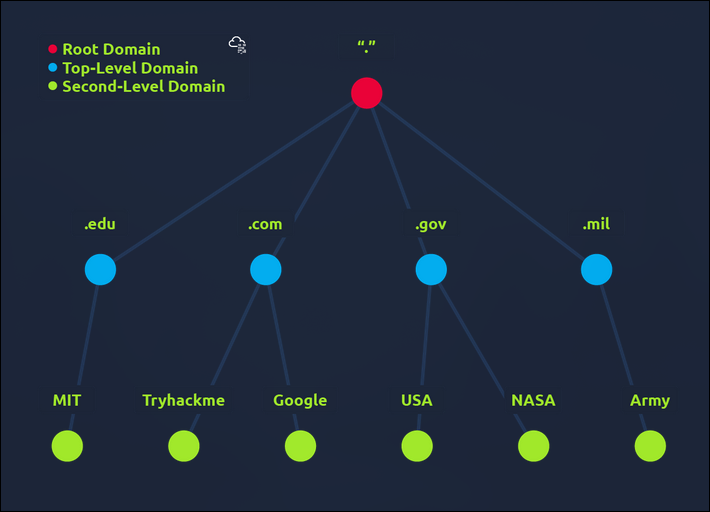

# TryHackMe: DNS In Details

**Room Link:** [DNS In Details](https://tryhackme.com/room/dnsindetail)
**Category:** How The Web Works
**Difficulty:** easy

# Overview

### What is DNS ?

DNS (Domain Name System) memberikan cara sederhana bagi kita untuk berkomunikasi dengan perangkat di internet tanpa mengingat angka-angka kompleks

### Domain Hierarchy

Domain Hierarchy merupakan sistem penamaan terstruktur yang menyerupai pohon terbalik, setiap tingkatan dipisahkan dengan tanda (`.`) dan dibaca dari kanan ke kiri, memastikan bahwa setiap alamat di internet bersifat unik dan dapat dikelola secara terdistribusi

struktur Domain Hierarchy:

### 1. Root Domain

Root domain adalah tingkat tertinggi dalam sistem domain hierarchy, diwakili oleh tanda titik (`.`) dan berada di puncak nama domain, contoh `domain.com`, `.` adalah root domain ,Root domain sangat penting untuk resolusi DNS, karena membantu menavigasi seluruh struktur domain

### 2. TLD (Top Level Domain)

TLD adalah bagian paling kanan dari nama domain, contoh `domain.com`, tepat setelah titik terakhir `.com`,

TLD dibagi menjadi dua kategori utama:

1. **gTLID (Generic Top Level Domain):** Digunakan untuk memberitahu pengguna tentang tujuan atau bidang situs tersebut

Contoh:

- **.com:** Digunakan untuk tujuan komersial (Commercial)

- **.org:** Digunakan untuk situs organisasi (Organitation)

- **.edu:** Digunakan untuk instansi pendidikan (Education)

- **.gov:** Digunakan untuk instansi pemerintah (Goverment)

2. **ccTLD (Country Code Top Level Domain):** Digunakan untuk menunjukkan lokasi geografis atau asal negara dari sebuah situs (domain)

contoh:

- **.co.uk:** Untuk situs yang berbasis di Inggris (United Kingdom)

- **.id:** Untuk situs negaraku yaitu indonesia

### Nama domain di era Modern (sekarang)

- .online

- .club

- .biz

- dan banyak

### DNS Record Types

DNS menggunakan berbagai tipe record untuk menyimpan data spesifik. Berikut adalah daftar informasi yang paling umum ditemukan

- **A Record:** Catatan ini ditetapkan ke alamat IPv4, misalnya 104.26.10.229

- **AAAA Record:** Catatan ini ditetapkan ke alamat IPv6, misalnya 2606:4700:20::681a:be5

- **CNAME Record:** CNAME (Canonical Name) adalah tipe resource record yang berfungsi untuk memetakan sebuah nama alias (nama samaran) ke nama domain lain yang bersifat canonical (nama asli). Berbeda dengan A Record yang langsung mengarah pada alamat IP, CNAME mengarahkan query ke entitas domain lainnya

- **MX Record:** MX (Mail Exchange) Record adalah tipe catatan sumber daya yang berfungsi untuk menetapkan server pengiriman surat (mail server) yang bertanggung jawab atas penerimaan email untuk sebuah domain

- **TXT Record:** (Text) Record adalah tipe DNS yang memungkinkan pemilik domain untuk memasukkan informasi berbasis teks ke dalam sistem DNS, Berbeda dengan catatan DNS lainnya yang memiliki struktur kaku untuk alamat IP atau server, TXT record merupakan kolom teks bebas yang sangat fleksibel untuk berbagai keperluan administratif dan keamanan.
