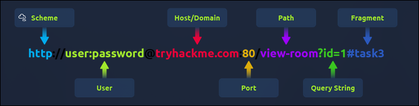

# TryHackMe: HTTP In Details

**Room Link:** [What Is Networking](https://tryhackme.com/room/whatisnetworking)
**Category:** How The Web Works
**Difficulty:** easy

# Overview

Room HTTP in Detail di berfokus pada pemahaman mendalam tentang protokol komunikasi paling mendasar di internet: **Hypertext Transfer Protocol (HTTP).** disini mempelajari bagaimana data ditransmisikan antara browser dan web server, serta memahami anatomi di balik setiap permintaan yang kita buat di web.

### What is HTTP ? (Hypertext Transfer Protocol)

HTTP adalah protokol yang digunakan setiap kali kita mengunjungi sebuah situs web, Protokol ini dikembangkan oleh Tim Berners-Lee dan timnya antara tahun 1989-1991. HTTP adalah serangkaian aturan yang digunakan untuk berkomunikasi dengan server web untuk mentransmisikan data halaman web, baik itu HTML, gambar, video, dan sebagainya.

### What is HTTPS? (HyperText Transfer Protocol Secure)

HTTPS adalah versi aman dari HTTP, data di HTTPS dienkripsi sehingga tidak hanya mencegah orang melihat data yang kita terima dan kirim, tetapi juga memberikan jaminan bahwa kita sedang mengunjungi server web yang benar dan bukan sesuatu yang menyamar. Dengan demikian, HTTPS membantu melindungi integritas dan kerahasiaan data Anda saat
berkomunikasi di internet

saat kita sedang mengakses sebuah situs web, browser perlu membuat request ke server web untuk mendapatkan aset seperti HTML, gambar, dll, Sebelum itu kita perlu memberi tahu browser secara spesifik bagaimana dan di mana mengakses sumber daya ini. Di sinilah URL (Uniform Resource Locator) berperan penting

### What is A URL ? (Uniform Resource Locator)

URL adalah alamat yang digunakan untuk mengidentifikasi dan mengakses sumber daya di internet, URL memberi tahu browser bagaimana dan di mana menemukan halaman web atau file tertentu, Sebuah URL biasanya terdiri dari beberapa bagian, termasuk protokol (seperti HTTP atau HTTPS), nama domain, dan jalur ke sumber daya spesifik. Contohnya, dalam URL `https://www.domain.com/index.html`, `https` adalah protokol, `www.domain.com` adalah nama domain, dan `/index.html` adalah jalur ke file yang diminta.

Berikut fitur-fitur yang ada di URL:

<p align="center">

</p>

-

- **Scheme:** Ini menginstruksikan protokol apa yang digunakan untuk mengakses sumber daya seperti HTTP, HTTPS, FTP (File Transfer Protocol).

- **User:** Beberapa layanan memerlukan authentikasi untuk login, kita dapat memasukkan nama pengguna dan kata sandi ke dalam URL untuk login.

- **Host:** Nama domain atau alamat IP server yang ingin diakses.

- **Port:** Port yang akan disambungkan, biasanya 80 untuk HTTP dan 443 untuk HTTPS, tetapi ini dapat dihosting di port mana pun antara 1 - 65535.

- **Path:** Nama file atau lokasi sumber daya yang kita coba akses

- **Query String:** Sedikit informasi tambahan yang dapat dikirim ke jalur yang diminta. Misalnya, /blog?id=1 akan memberi tahu jalur blog bahwa kita ingin menerima artikel blog dengan id 1.

### HTTP Request & Response

Contoh Request:

```http

GET /index.html HTTP/1.1
Host: domain.com
User-Agent: Mozilla/5.0 (Arch Linux)
Accept: text/html
```

- **Line 1:** Berisi Method `(GET)`, Path target `(/index.html)`, dan versi protokol `(HTTP/1.1)`

- **Line 2:** Header `Host` untuk menentukan alamat server tujuan

- **Line 3:** `User-Agent` untuk memberitahu server kalau user sedang menggunakan browser `Mozilla/5.0` di Arch Linux

- **Line 4:** `Accept` untuk memberitahu server tipe konten apa yang bisa diterima `(misal: text/html)`

Contoh Response:

```http
HTTP/1.1 200 OK
Date: Wed, 28 Jan 2026 19:40:00 GMT
Server: Dimm-Arch-Server/2.4
Content-Type: text/html
Content-Length: 173
Connection: keep-alive
Cache-Control: public, max-age=3600

<html>
<head>
    <title>Dimm HTTP Response</title>
</head>
<body>
    <h1>Welcome to Dimm Server !</h1>
    <p>Status: Online</p>
</body>
</html>
```

- **Line 1** `(HTTP/1.1 200 OK)`: Baris status utama. `HTTP/1.1` adalah versi protokol, dan `200 OK` adalah status code yang memberitahu client bahwa permintaan berhasil diproses tanpa masalah

- **Line 2** `(Date: Wed, 28 Jan 2026...):` Menunjukkan waktu (timestamp) kapan respon
  tersebut dibuat oleh server.

- **Line 3** `(Server: Dimm-Arch-Server/2026.01):` Memberitahu client jenis dan versi perangkat lunak web server yang digunakan (dalam hal ini, server custom milik ku di ekosistem Arch).

- **Line 4** `(Content-Type: text/html):` Menjelaskan format data yang dikirim. Label `text/html` menginstruksikan browser untuk merender isi body sebagai halaman web.

- **Line 5** `(Content-Length: 173):` Memberitahu ukuran muatan (payload) data dalam satuan byte. Angka ini harus akurat agar browser tahu kapan proses download data selesai.

- **Line 6** `(Connection: keep-alive):` Instruksi agar koneksi antara browser dan server tetap terbuka untuk permintaan selanjutnya, sehingga akses terasa lebih cepat dan efisien.

- **Line 7** `(Cache-Control: public, max-age=3600):` Mengatur kebijakan penyimpanan sementara (caching). Ini memberitahu browser bahwa konten ini boleh disimpan di memori selama 3600 detik (1 jam).

- **Line 8** `(Blank Line):` Baris kosong wajib yang berfungsi sebagai pemisah mutlak antara bagian headers (informasi administratif) dengan bagian body (isi konten).

### HTTP Methods

HTTP method adalah cara yang digunakan oleh klien (seperti browser) untuk berkomunikasi dengan server web. Metode ini menentukan jenis tindakan yang ingin dilakukan pada sumber daya tertentu.

Beberapa metode HTTP yang umum digunakan antara lain:

1. **GET (Read):** Digunakan untuk meminta atau mengambil data/informasi dari server.

2. **PUT (Cread):** Digunakan untuk mengirimkan data baru ke server web dan membuat record baru

3. **POST (Update):** Digunakan untuk memperbarui atau mengganti informasi yang sudah ada di server.

4. **DELETE (Delete):** Digunakan untuk menghapus sumber daya atau informasi tertentu dari server secara permanen.

### HTTP Status Code

HTTP Status Codes adalah kode berupa angka yang dikirim oleh server sebagai bagian dari respons terhadap permintaan HTTP. Kode ini memberikan informasi tentang hasil dari permintaan yang dilakukan oleh client.

Kode-kode ini dikelompokkan ke dalam lima kategori berbeda berdasarkan angka pertamanya untuk memudahkan identifikasi status komunikasi.

| Rentang     | Kategori                 | Deskripsi (TryHackMe Reference)                                                                                                                 |
| :---------- | :----------------------- | :---------------------------------------------------------------------------------------------------------------------------------------------- |
| **100-199** | **Information Response** | Memberitahu klien bahwa permintaan telah diterima dan mereka harus terus mengirimkan sisa permintaan. Kode ini sudah jarang ditemukan saat ini. |
| **200-299** | **Success**              | Menunjukkan bahwa permintaan klien telah berhasil diproses oleh server dengan sukses.                                                           |
| **300-399** | **Redirection**          | Digunakan untuk mengalihkan permintaan klien ke sumber daya lain, baik halaman web atau website yang berbeda.                                   |
| **400-499** | **Client Errors**        | Digunakan untuk menginformasikan klien bahwa terdapat kesalahan pada permintaan yang mereka kirimkan.                                           |
| **500-599** | **Server Errors**        | Menandakan masalah besar yang terjadi di sisi server saat mencoba menangani permintaan tersebut.                                                |

#### **Daftar Status Code Populer**

Berikut adalah beberapa kode status yang wajib dipahami dalam analisis trafik web:

- **200 OK**: Permintaan berhasil diproses secara sempurna.
- **201 Created**: Berhasil membuat data baru di server (misalnya setelah registrasi akun).
- **301 Moved Permanently**: Halaman yang diminta telah pindah ke URL baru secara permanen.
- **401 Unauthorized**: Akses ditolak karena klien belum melakukan login/autentikasi.
- **403 Forbidden**: Klien tidak memiliki izin akses ke halaman tersebut meskipun sudah login.
- **404 Not Found**: Server tidak dapat menemukan halaman atau file yang diminta oleh klien.
- **500 Internal Server Error**: Terjadi kesalahan teknis umum pada sistem di sisi server.
- **503 Service Unavailable**: Server sedang tidak tersedia karena kelebihan beban atau sedang dalam pemeliharaan.

### HTTP Headers

HTTP headers adalah informasi tambahan yang dikirim bersama dengan request atau respons HTTP. Headers ini memberikan konteks dan metadata tentang data yang sedang ditransfer.

### **Request Headers**

- **Host:** adalah header yang memberi tahu server nama domain yang diinginkan oleh client saat membuat request, contoh nya (`domain.com`)

- **User-Agent:** adalah header yang mengidentifikasi jenis perangkat, sistem operasi,
  dan aplikasi client yang digunakan untuk mengakses server.

- **Content-Length:** Memberitahu server seberapa besar data yang dikirim (misal saat mengisi formulir) agar server tahu berapa banyak data yang harus diterima.

- **Accept-Encoding:** Memberitahu server jenis kompresi apa yang didukung oleh browser (seperti gzip) agar data bisa dikirim lebih cepat.

- **Cookie:** Data yang dikirim kembali ke server untuk membantu server mengingat informasi client sebelumnya

#### **Response Headers**

- **Set-Cookie:** Perintah bagi browser untuk menyimpan cookie.

- **Cache-Control:** Durasi penyimpanan data di cache browser.

- **Content-Type:** Jenis format data yang dikembalikan (HTML, CSS, dll).

- **Content-Encoding:** Metode kompresi yang digunakan oleh server.

### Cookies

HTTP adalah protokol **stateless**, yang berarti server tidak mengingat permintaan sebelumnya dari client yang sama. Cookies diciptakan untuk mengatasi masalah ini dengan menyimpan informasi kecil di sisi browser client.

#### **Cara Kerja Cookies**

1. **Set-Cookie (Response):** Saat login, server mengirim header `Set-Cookie` yang berisi ID unik (session token).
2. **Storage:** Browser akan menyimpan token itu di memori lokal.
3. **Cookie (Request):** Setiap kali client buka halaman baru di situs yang sama, browser otomatis menyelipkan header `Cookie` berisi token tadi buat mengkonfirmasi kalau yang buka halaman masih orang yang sama.

#### **Kegunaan Utama Cookies**

- **Session Management:** Menjaga status login atau isi keranjang belanja.
- **Personalization:** Mengingat preferensi user (seperti Dark Mode atau bahasa).
- **Tracking:** Merekam aktivitas user untuk kepentingan analitik atau iklan.
